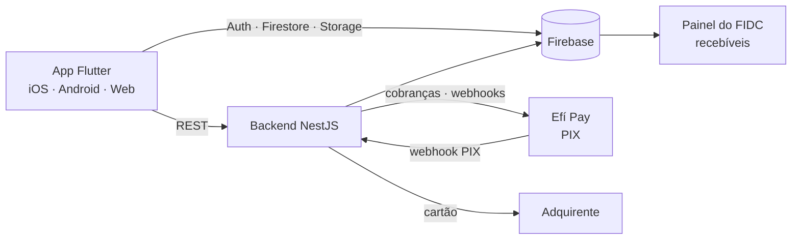

# Pag Pag — POS digital para pequenos comerciantes (Neves Capital)

Aplicativo mobile **Flutter** que transforma o celular em uma **maquininha de pagamentos**: o comerciante recebe por **cartão de crédito** e **PIX** sem hardware dedicado. Desenvolvido para um **FIDC (Fundo de Investimento em Direitos Creditórios)**, que antecipa os recebíveis gerados pelas vendas.

> Projeto real. Chaves, certificados e credenciais não estão versionados.

## O problema

Microempreendedores e autônomos precisam aceitar cartão e PIX, mas maquininhas físicas têm custo de aquisição, aluguel e logística. Para o fundo, cada venda registrada é um recebível que pode ser antecipado — desde que a operação seja segura, rastreável e conciliada.

## A solução

- **Cadastro em 7 etapas** com validação de documentos e dados bancários
- **Login por OTP** via WhatsApp/SMS e **autenticação biométrica** (Face ID / Touch ID)
- **Fluxo de pagamento em 5 passos** para cartão de crédito, com detecção de bandeira e criptografia dos dados sensíveis
- **PIX via Efí Pay**: geração de cobrança, QR Code, gestão de chaves PIX e recebimento de webhooks de confirmação
- **Histórico de vendas** e dashboard do comerciante
- **Backend NestJS** (Cloud Functions/Railway) para orquestrar a integração com o provedor de pagamento e os webhooks

## Arquitetura



## Stack

| Camada | Tecnologia |
|---|---|
| Mobile | Flutter / Dart, arquitetura por *features* (`lib/features`, `lib/core`, `lib/shared`) |
| Segurança | `flutter_secure_storage`, `local_auth` (biometria), `encrypt`/`crypto`, OWASP MASVS-STORAGE |
| Backend | NestJS (TypeScript), Firebase Admin |
| Dados / Auth | Firebase Auth, Cloud Firestore, Firebase Storage |
| Pagamentos | Efí Pay (PIX), tokenização de cartão |
| Infra | Firebase Hosting, Railway |

## Decisões técnicas

**Firebase como backend de dados, NestJS para integrações.** Autenticação, perfil e histórico ficam no Firestore (offline-first, regras de segurança); tudo que envolve credenciais de terceiros (Efí Pay, adquirente) passa pelo backend NestJS, nunca pelo app.

**Segurança mobile como requisito de produto.** Por lidar com dados de cartão, o app segue MASVS: armazenamento seguro, biometria obrigatória para operações sensíveis, nenhum dado de cartão persistido em texto plano.

**PIX assíncrono com webhooks.** A confirmação de pagamento chega por webhook e é gravada no Firestore; o app reage em tempo real via *stream*. A reconciliação periódica cobre webhooks perdidos.

## Como rodar

```bash
flutter pub get
cp .env.example .env            # URLs do backend e chaves públicas
flutterfire configure           # gera lib/firebase_options.dart para o seu projeto Firebase
flutter run
```

Backend:

```bash
cd functions
npm install
cp .env.example .env            # credenciais Efí Pay, Firebase Admin
npm run start:dev
```

## Status

Cadastro, login, biometria, pagamento por cartão, chaves PIX e histórico funcionais. Integração PIX homologada; reconciliação de webhooks e testes automatizados em andamento. Detalhes em [`HANDOFF.md`](HANDOFF.md).

## Autor

**Wagner Freitas** — [GitHub](https://github.com/wagfreitas) · [LinkedIn](https://www.linkedin.com/in/wagfreitas)
