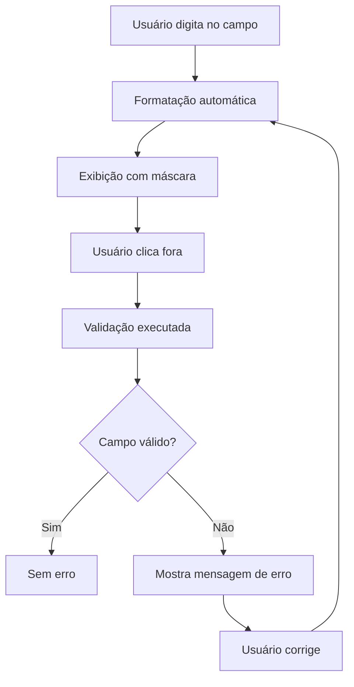

# 🎭 Máscaras Implementadas - Tela de Cadastro

## ✅ Campos com Máscara

### 1. **CPF** - `xxx.xxx.xxx-xx`
- **Componente:** `CpfInputField`
- **Máscara:** `123.456.789-09`
- **Validação:** Algoritmo oficial do CPF
- **Formato de envio:** Apenas números `12345678909`

### 2. **Telefone** - `(xx)xxxxx-xxxx`
- **Componente:** `PhoneInputField`
- **Máscara:** `(11)98765-4321`
- **Validação:** 10 ou 11 dígitos, DDD válido
- **Formato de envio:** Apenas números `11987654321`

### 3. **CEP** - `xxxxx-xxx`
- **Componente:** `CepInputField`
- **Máscara:** `01310-100`
- **Validação:** 8 dígitos
- **Formato de envio:** Apenas números `01310100`

## 🧪 Como Testar

### **Teste 1 - CPF**
```
✅ Válido: 111.444.777-35
❌ Inválido: 111.111.111-11 (todos iguais)
❌ Inválido: 123.456.789-00 (dígitos errados)
```

### **Teste 2 - Telefone**
```
✅ Válido: (11)98765-4321 (11 dígitos com 9)
✅ Válido: (11)3456-7890 (10 dígitos sem 9)
❌ Inválido: (99)98765-4321 (DDD inválido)
❌ Inválido: (11)11111-1111 (todos iguais)
```

### **Teste 3 - CEP**
```
✅ Válido: 01310-100
✅ Válido: 12345-678
❌ Inválido: 00000-000 (todos zeros)
❌ Inválido: 11111-111 (todos iguais)
```

## 📱 Fluxo de Validação



## 🎯 Validações Implementadas

### **CPF:**
- ✅ 11 dígitos obrigatórios
- ✅ Não podem ser todos iguais
- ✅ Dígitos verificadores corretos
- ✅ Algoritmo oficial do CPF

### **Telefone:**
- ✅ 10 ou 11 dígitos
- ✅ DDD entre 11 e 99
- ✅ Não podem ser todos iguais
- ✅ Formato válido

### **CEP:**
- ✅ 8 dígitos obrigatórios
- ✅ Não podem ser todos iguais
- ✅ Formato válido

## 🔄 Formato de Envio ao Backend

Todos os campos mascarados enviam **apenas números** para o backend:

| Campo | Exibição | Envio ao Backend |
|-------|----------|------------------|
| **CPF** | `123.456.789-09` | `12345678909` |
| **Telefone** | `(11)98765-4321` | `11987654321` |
| **CEP** | `01310-100` | `01310100` |

## 💡 Helpers Criados

### **CpfHelper**
- `formatCpf()` - Formata com máscara
- `validateCpf()` - Valida CPF
- `getCpfNumbers()` - Retorna apenas números
- `isValidCpf()` - Verifica se é válido
- `cleanCpf()` - Remove caracteres não numéricos

### **PhoneHelper**
- `formatPhone()` - Formata com máscara
- `validatePhone()` - Valida telefone
- `getPhoneNumbers()` - Retorna apenas números
- `isValidPhone()` - Verifica se é válido
- `cleanPhone()` - Remove caracteres não numéricos

### **CepHelper**
- `formatCep()` - Formata com máscara
- `validateCep()` - Valida CEP
- `getCepNumbers()` - Retorna apenas números
- `isValidCep()` - Verifica se é válido
- `cleanCep()` - Remove caracteres não numéricos

## 🚀 Exemplo de Uso

```dart
// CPF
CpfInputField(
  controller: _cpfController,
  hintText: 'Digite seu CPF',
  validator: CpfHelper.validateCpf,
  onFocusLost: () {
    setState(() {});
  },
)

// Telefone
PhoneInputField(
  controller: _phoneController,
  hintText: 'Digite seu telefone',
  validator: PhoneHelper.validatePhone,
  onFocusLost: () {
    setState(() {});
  },
)

// CEP
CepInputField(
  controller: _cepController,
  hintText: 'Digite seu CEP',
  validator: CepHelper.validateCep,
  onFocusLost: () {
    setState(() {});
  },
)
```

## 📊 Dados Coletados

```dart
final userData = {
  'fullName': _fullNameController.text.trim(),
  'cpf': CpfHelper.getCpfNumbers(_cpfController.text),      // apenas números
  'email': _emailController.text.trim(),
  'phone': PhoneHelper.getPhoneNumbers(_phoneController.text), // apenas números
  'cep': CepHelper.getCepNumbers(_cepController.text),       // apenas números
};
```

## ✨ Recursos

- ✅ **Formatação automática** enquanto digita
- ✅ **Validação no foco perdido** (não mostra erro enquanto digita)
- ✅ **Limitação de caracteres** (não permite digitar mais que o necessário)
- ✅ **Feedback visual** com bordas coloridas
- ✅ **Mensagens de erro** claras e objetivas
- ✅ **Design consistente** com o tema da aplicação
- ✅ **Ícones apropriados** para cada campo
- ✅ **Envio otimizado** (apenas números para o backend)

## 🎨 Design

Todos os componentes seguem o design system da aplicação:
- **Cor de fundo:** `#1A2B1F` (verde escuro)
- **Cor primária:** `#22C55E` (verde vibrante)
- **Borda focada:** Verde vibrante
- **Borda de erro:** Vermelho
- **Ícones:** Cinza claro
- **Texto:** Branco
- **Placeholder:** Cinza claro

---

**Implementação completa e pronta para uso!** 🎉

