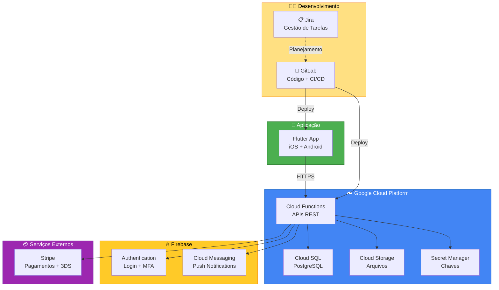
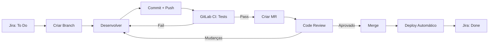

# 🚀 Guia de Implementação - Pag Pag

> **Documento:** Guia Completo de Implantação
> 
> **Projeto:** Pag Pag (Neves Capital)
> 
> **Data:** Outubro 2025
> 
> **Versão:** 1.0

---

## 📋 Índice

1. [Visão Geral](#visão-geral)
2. [Pré-requisitos](#pré-requisitos)
3. [Fase 1: Setup de Contas e Ferramentas](#fase-1-setup-de-contas-e-ferramentas)
4. [Fase 2: Infraestrutura GCP](#fase-2-infraestrutura-gcp)
5. [Fase 3: Firebase](#fase-3-firebase)
6. [Fase 4: Stripe](#fase-4-stripe)
7. [Fase 5: GitLab CI/CD](#fase-5-gitlab-cicd)
8. [Fase 6: Jira](#fase-6-jira)
9. [Fase 7: Desenvolvimento](#fase-7-desenvolvimento)
10. [Fase 8: Deploy e Monitoramento](#fase-8-deploy-e-monitoramento)
11. [Checklist Final](#checklist-final)

---

## 🎯 Visão Geral

### Arquitetura da Solução



### Stack Tecnológica

| Camada | Tecnologia | Propósito |
|--------|-----------|-----------|
| **App Mobile** | Flutter 3.16+ | iOS + Android |
| **APIs** | Node.js 20 / Python 3.11 | Cloud Functions |
| **Banco de Dados** | PostgreSQL 15 | Dados transacionais |
| **Autenticação** | Firebase Auth | Login + MFA |
| **Pagamentos** | Stripe | Processamento + 3DS 2.0 |
| **Storage** | Cloud Storage | Documentos KYC |
| **CI/CD** | GitLab CI | Deploy automatizado |
| **Gestão** | Jira | Sprints + Kanban |
| **Monitoramento** | Cloud Logging/Monitoring | Observabilidade |

---

## 🔧 Pré-requisitos

### Contas Necessárias

- [ ] Conta Google (Gmail)
- [ ] Cartão de crédito internacional (para GCP e Stripe)
- [ ] Telefone celular (para verificação 2FA)
- [ ] Email corporativo (opcional, mas recomendado)

### Ferramentas Locais

```bash
# macOS
brew install --cask google-cloud-sdk
brew install node@20
brew install python@3.11
brew install postgresql@15
brew install git

# Verificar instalações
gcloud --version  # >= 450.0.0
node --version    # >= v20.0.0
python3 --version # >= 3.11.0
psql --version    # >= 15.0
git --version     # >= 2.40.0

# Flutter (via FVM recomendado)
brew tap leoafarias/fvm
brew install fvm
fvm install 3.16.0
fvm global 3.16.0
fvm flutter doctor
```

### Extensões VS Code

```json
{
  "recommendations": [
    "dart-code.dart-code",
    "dart-code.flutter",
    "googlecloudtools.cloudcode",
    "ms-vscode.vscode-typescript-next",
    "dbaeumer.vscode-eslint",
    "esbenp.prettier-vscode",
    "gitlab.gitlab-workflow",
    "atlassian.atlascode"
  ]
}
```

---

## 📝 Fase 1: Setup de Contas e Ferramentas

### 1.1 Google Cloud Platform

#### Criar Conta GCP

```bash
# 1. Acessar console
open https://console.cloud.google.com

# 2. Criar novo projeto
gcloud projects create pag-pag-prod \
  --name="Pag Pag Production" \
  --set-as-default

# 3. Vincular billing (via console web)
# https://console.cloud.google.com/billing

# 4. Configurar quota e budget alerts
gcloud billing budgets create \
  --billing-account=BILLING_ACCOUNT_ID \
  --display-name="Pag Pag Monthly Budget" \
  --budget-amount=100BRL \
  --threshold-rule=percent=50 \
  --threshold-rule=percent=90 \
  --threshold-rule=percent=100

# 5. Habilitar APIs necessárias
gcloud services enable \
  sqladmin.googleapis.com \
  cloudfunctions.googleapis.com \
  storage.googleapis.com \
  secretmanager.googleapis.com \
  cloudscheduler.googleapis.com \
  logging.googleapis.com \
  monitoring.googleapis.com \
  cloudtrace.googleapis.com \
  compute.googleapis.com
```

#### Estrutura de Projetos

```
Organização: Neves Capital
│
├── pag-pag-dev (Desenvolvimento)
│   ├── Cloud SQL (dev)
│   ├── Cloud Functions (dev)
│   └── Firebase (dev)
│
├── pag-pag-staging (Homologação)
│   ├── Cloud SQL (staging)
│   ├── Cloud Functions (staging)
│   └── Firebase (staging)
│
└── pag-pag-prod (Produção)
    ├── Cloud SQL (prod)
    ├── Cloud Functions (prod)
    └── Firebase (prod)
```

### 1.2 Firebase

#### Criar Projeto Firebase

```bash
# 1. Instalar Firebase CLI
npm install -g firebase-tools

# 2. Login
firebase login

# 3. Criar projeto (via console)
open https://console.firebase.google.com

# Criar 3 projetos:
# - pag-pag-dev
# - pag-pag-staging
# - pag-pag-prod

# 4. Vincular projetos Firebase aos projetos GCP
firebase projects:addfirebase pag-pag-prod

# 5. Instalar FlutterFire CLI
dart pub global activate flutterfire_cli

# 6. Configurar Firebase no Flutter
cd /Users/wagneralves/StudioProjects/neves_capital
flutterfire configure \
  --project=pag-pag-prod \
  --out=lib/firebase_options.dart \
  --ios-bundle-id=com.nevescapital.pagpag \
  --android-package-name=com.nevescapital.pagpag
```

#### Configurar Firebase Authentication

```bash
# Via Firebase Console
open https://console.firebase.google.com/project/pag-pag-prod/authentication

# Habilitar provedores:
# 1. Email/Password ✅
# 2. Phone ✅

# Configurar templates de email:
# 1. Verificação de email
# 2. Redefinição de senha
# 3. Mudança de email

# Configurar MFA (Multi-Factor Authentication)
# Settings > Sign-in method > Multi-factor authentication
# - Ativar SMS
# - Ativar TOTP (opcional)
```

### 1.3 Stripe

#### Criar Conta Stripe

```bash
# 1. Criar conta
open https://dashboard.stripe.com/register

# 2. Ativar conta brasileira
# Settings > Account details
# - Country: Brazil
# - Currency: BRL

# 3. Obter chaves API
open https://dashboard.stripe.com/apikeys

# Test Keys (desenvolvimento):
# - Publishable key: pk_test_...
# - Secret key: sk_test_...

# Live Keys (produção - após ativação):
# - Publishable key: pk_live_...
# - Secret key: sk_live_...

# 4. Ativar 3D Secure 2.0
open https://dashboard.stripe.com/settings/payment_methods

# Payment methods settings:
# - Cards: ✅ Enabled
# - 3D Secure: ✅ Always request (recommended)
# - Stripe Radar: ✅ Enabled (anti-fraud)

# 5. Configurar Webhooks
open https://dashboard.stripe.com/webhooks

# Adicionar endpoint:
# URL: https://southamerica-east1-pag-pag-prod.cloudfunctions.net/stripeWebhook
# Events:
# - payment_intent.succeeded
# - payment_intent.payment_failed
# - customer.created
# - customer.updated
# - charge.refunded
```

#### Configurar Stripe no GCP

```bash
# Salvar chaves no Secret Manager
echo -n "sk_test_..." | gcloud secrets create stripe-secret-key-test \
  --data-file=- \
  --replication-policy=automatic

echo -n "sk_live_..." | gcloud secrets create stripe-secret-key-live \
  --data-file=- \
  --replication-policy=automatic

# Webhook signing secret
echo -n "whsec_..." | gcloud secrets create stripe-webhook-secret \
  --data-file=- \
  --replication-policy=automatic
```

### 1.4 GitLab

#### Criar Projeto GitLab

```bash
# 1. Criar conta GitLab
open https://gitlab.com/users/sign_up

# 2. Criar grupo
# https://gitlab.com/groups/new
# Group name: neves-capital
# Visibility: Private

# 3. Criar projeto
# https://gitlab.com/projects/new
# Project name: pag-pag
# Visibility: Private
# Initialize with README: ✅

# 4. Configurar acesso SSH
ssh-keygen -t ed25519 -C "seu-email@example.com"
cat ~/.ssh/id_ed25519.pub
# Adicionar em: https://gitlab.com/-/profile/keys

# 5. Clonar repositório
cd /Users/wagneralves/StudioProjects
git clone git@gitlab.com:neves-capital/pag-pag.git pag-pag-gitlab
cd pag-pag-gitlab

# 6. Copiar código existente
cp -r /Users/wagneralves/StudioProjects/neves_capital/* .
git add .
git commit -m "Initial commit: Flutter app base"
git push origin main
```

#### Estrutura de Branches

```
main (produção)
  │
  ├── staging (homologação)
  │   │
  │   └── develop (desenvolvimento)
  │       │
  │       ├── feature/auth-cpf-login
  │       ├── feature/kyc-upload
  │       ├── feature/stripe-integration
  │       └── feature/biometric-auth
```

```bash
# Criar branches
git checkout -b develop
git push origin develop

git checkout -b staging
git push origin staging

# Proteger branches
# GitLab > Settings > Repository > Protected branches
# - main: Maintainers only
# - staging: Developers + Maintainers
# - develop: All members
```

### 1.5 Jira

#### Criar Workspace Jira

```bash
# 1. Criar conta
open https://www.atlassian.com/software/jira/free

# 2. Criar workspace
# Site name: neves-capital
# URL: https://neves-capital.atlassian.net

# 3. Criar projeto
# Template: Scrum
# Name: Pag Pag
# Key: PAGPAG
```

#### Configurar Projeto Jira

```yaml
Workflow:
  - To Do
  - In Progress
  - Code Review
  - Testing
  - Done

Issue Types:
  - Epic (Épicos grandes)
  - Story (User Stories)
  - Task (Tarefas técnicas)
  - Bug (Bugs)
  - Subtask (Subtarefas)

Custom Fields:
  - Ambiente (Dev/Staging/Prod)
  - Severity (Critical/High/Medium/Low)
  - Story Points (1, 2, 3, 5, 8, 13)
```

#### Integração GitLab + Jira

```bash
# 1. Obter API Token do Jira
open https://id.atlassian.com/manage-profile/security/api-tokens

# 2. Configurar no GitLab
# GitLab > Settings > Integrations > Jira
# - Web URL: https://neves-capital.atlassian.net
# - Username: seu-email@example.com
# - Password/API token: SEU_API_TOKEN
# - Transition IDs: Configure conforme workflow

# 3. Vincular commits ao Jira
# Formato: PAGPAG-123: Implement CPF validation
git commit -m "PAGPAG-123: Implement CPF validation"
```

---

## ☁️ Fase 2: Infraestrutura GCP

### 2.1 Configurar VPC e Rede

```bash
# 1. Criar VPC
gcloud compute networks create pagpag-vpc \
  --subnet-mode=custom \
  --bgp-routing-mode=regional

# 2. Criar subnet
gcloud compute networks subnets create pagpag-subnet \
  --network=pagpag-vpc \
  --region=southamerica-east1 \
  --range=10.0.0.0/24

# 3. Criar regras de firewall
gcloud compute firewall-rules create pagpag-allow-internal \
  --network=pagpag-vpc \
  --allow=tcp,udp,icmp \
  --source-ranges=10.0.0.0/24

gcloud compute firewall-rules create pagpag-allow-postgres \
  --network=pagpag-vpc \
  --allow=tcp:5432 \
  --source-ranges=10.0.0.0/24

# 4. Criar VPC Connector (para Cloud Functions)
gcloud compute networks vpc-access connectors create pagpag-connector \
  --network=pagpag-vpc \
  --region=southamerica-east1 \
  --range=10.8.0.0/28
```

### 2.2 Cloud SQL (PostgreSQL)

```bash
# 1. Criar instância Cloud SQL
gcloud sql instances create pagpag-db \
  --database-version=POSTGRES_15 \
  --tier=db-f1-micro \
  --region=southamerica-east1 \
  --network=projects/pag-pag-prod/global/networks/pagpag-vpc \
  --no-assign-ip \
  --storage-type=SSD \
  --storage-size=10GB \
  --storage-auto-increase \
  --backup-start-time=03:00 \
  --maintenance-window-day=SUN \
  --maintenance-window-hour=04 \
  --enable-bin-log \
  --retained-backups-count=7 \
  --deletion-protection

# 2. Criar database
gcloud sql databases create pagpag \
  --instance=pagpag-db

# 3. Criar usuário
gcloud sql users create pagpag-api \
  --instance=pagpag-db \
  --password=$(openssl rand -base64 32)

# 4. Obter connection name
gcloud sql instances describe pagpag-db \
  --format='value(connectionName)'
# Output: pag-pag-prod:southamerica-east1:pagpag-db

# 5. Conectar localmente (para setup inicial)
./cloud-sql-proxy pag-pag-prod:southamerica-east1:pagpag-db &

# 6. Criar schema
psql -h 127.0.0.1 -U pagpag-api -d pagpag -f schema.sql
```

#### Schema SQL (`schema.sql`)

```sql
-- 1. Extensões
CREATE EXTENSION IF NOT EXISTS "uuid-ossp";
CREATE EXTENSION IF NOT EXISTS "pgcrypto";

-- 2. Tabela de usuários
CREATE TABLE users (
    id UUID PRIMARY KEY DEFAULT uuid_generate_v4(),
    cpf_encrypted BYTEA NOT NULL,
    email_encrypted BYTEA NOT NULL,
    phone_encrypted BYTEA NOT NULL,
    firebase_uid VARCHAR(128) UNIQUE,
    created_at TIMESTAMP DEFAULT NOW(),
    updated_at TIMESTAMP DEFAULT NOW(),
    deleted_at TIMESTAMP
);

CREATE INDEX idx_users_firebase_uid ON users(firebase_uid);
CREATE INDEX idx_users_created_at ON users(created_at DESC);

-- 3. Tabela de perfil
CREATE TABLE user_profiles (
    id UUID PRIMARY KEY DEFAULT uuid_generate_v4(),
    user_id UUID NOT NULL REFERENCES users(id) ON DELETE CASCADE,
    name VARCHAR(255) NOT NULL,
    birth_date DATE,
    address_encrypted BYTEA,
    kyc_status VARCHAR(20) DEFAULT 'pending',
    kyc_verified_at TIMESTAMP,
    created_at TIMESTAMP DEFAULT NOW(),
    updated_at TIMESTAMP DEFAULT NOW()
);

CREATE INDEX idx_profiles_user_id ON user_profiles(user_id);
CREATE INDEX idx_profiles_kyc_status ON user_profiles(kyc_status);

-- 4. Tabela de documentos KYC
CREATE TABLE kyc_documents (
    id UUID PRIMARY KEY DEFAULT uuid_generate_v4(),
    user_id UUID NOT NULL REFERENCES users(id) ON DELETE CASCADE,
    document_type VARCHAR(50) NOT NULL,
    storage_url_encrypted BYTEA NOT NULL,
    status VARCHAR(20) DEFAULT 'pending',
    uploaded_at TIMESTAMP DEFAULT NOW(),
    verified_at TIMESTAMP,
    rejection_reason TEXT
);

CREATE INDEX idx_kyc_user_id ON kyc_documents(user_id);
CREATE INDEX idx_kyc_status ON kyc_documents(status);

-- 5. Tabela de transações
CREATE TABLE transactions (
    id UUID PRIMARY KEY DEFAULT uuid_generate_v4(),
    user_id UUID NOT NULL REFERENCES users(id),
    amount NUMERIC(12, 2) NOT NULL,
    currency VARCHAR(3) DEFAULT 'BRL',
    status VARCHAR(20) NOT NULL,
    metadata JSONB,
    stripe_payment_id VARCHAR(255),
    created_at TIMESTAMP DEFAULT NOW(),
    updated_at TIMESTAMP DEFAULT NOW()
);

CREATE INDEX idx_transactions_user_id ON transactions(user_id, created_at DESC);
CREATE INDEX idx_transactions_status ON transactions(status);
CREATE INDEX idx_transactions_stripe ON transactions(stripe_payment_id);
CREATE INDEX idx_transactions_metadata ON transactions USING GIN (metadata);

-- 6. Tabela de métodos de pagamento
CREATE TABLE payment_methods (
    id UUID PRIMARY KEY DEFAULT uuid_generate_v4(),
    user_id UUID NOT NULL REFERENCES users(id) ON DELETE CASCADE,
    type VARCHAR(20) NOT NULL,
    last_four VARCHAR(4),
    brand VARCHAR(20),
    is_default BOOLEAN DEFAULT FALSE,
    stripe_payment_method_id VARCHAR(255),
    created_at TIMESTAMP DEFAULT NOW()
);

CREATE INDEX idx_payment_methods_user_id ON payment_methods(user_id);

-- 7. Tabela de audit log
CREATE TABLE audit_log (
    id BIGSERIAL PRIMARY KEY,
    user_id UUID REFERENCES users(id),
    action VARCHAR(50) NOT NULL,
    table_name VARCHAR(50) NOT NULL,
    record_id UUID,
    old_data JSONB,
    new_data JSONB,
    ip_address INET,
    user_agent TEXT,
    created_at TIMESTAMP DEFAULT NOW()
);

CREATE INDEX idx_audit_user_id ON audit_log(user_id, created_at DESC);
CREATE INDEX idx_audit_table ON audit_log(table_name, created_at DESC);

-- 8. Trigger para updated_at
CREATE OR REPLACE FUNCTION update_updated_at_column()
RETURNS TRIGGER AS $$
BEGIN
    NEW.updated_at = NOW();
    RETURN NEW;
END;
$$ language 'plpgsql';

CREATE TRIGGER update_users_updated_at BEFORE UPDATE ON users
    FOR EACH ROW EXECUTE FUNCTION update_updated_at_column();

CREATE TRIGGER update_profiles_updated_at BEFORE UPDATE ON user_profiles
    FOR EACH ROW EXECUTE FUNCTION update_updated_at_column();

CREATE TRIGGER update_transactions_updated_at BEFORE UPDATE ON transactions
    FOR EACH ROW EXECUTE FUNCTION update_updated_at_column();

-- 9. Row Level Security (opcional, para multi-tenant)
ALTER TABLE users ENABLE ROW LEVEL SECURITY;
ALTER TABLE user_profiles ENABLE ROW LEVEL SECURITY;
ALTER TABLE kyc_documents ENABLE ROW LEVEL SECURITY;
ALTER TABLE transactions ENABLE ROW LEVEL SECURITY;

-- 10. Funções utilitárias
CREATE OR REPLACE FUNCTION get_user_by_cpf(encrypted_cpf BYTEA)
RETURNS TABLE (
    id UUID,
    email_encrypted BYTEA,
    firebase_uid VARCHAR
) AS $$
BEGIN
    RETURN QUERY
    SELECT u.id, u.email_encrypted, u.firebase_uid
    FROM users u
    WHERE u.cpf_encrypted = encrypted_cpf
    AND u.deleted_at IS NULL;
END;
$$ LANGUAGE plpgsql;

-- 11. Seed data (desenvolvimento)
-- INSERT INTO users (cpf_encrypted, email_encrypted, phone_encrypted, firebase_uid)
-- VALUES (...);
```

### 2.3 Secret Manager

```bash
# 1. Criar secrets
# Chave de criptografia (AES-256)
openssl rand -hex 32 > /tmp/encryption_key.txt
gcloud secrets create encryption-key \
  --data-file=/tmp/encryption_key.txt \
  --replication-policy=automatic
rm /tmp/encryption_key.txt

# Database password
gcloud secrets create db-password \
  --data-file=- <<< "$(openssl rand -base64 32)"

# Firebase Admin SDK
# Baixar de: https://console.firebase.google.com/project/pag-pag-prod/settings/serviceaccounts/adminsdk
gcloud secrets create firebase-admin-sdk \
  --data-file=firebase-admin-sdk.json

# 2. Dar acesso ao service account
gcloud secrets add-iam-policy-binding encryption-key \
  --member="serviceAccount:pag-pag-prod@appspot.gserviceaccount.com" \
  --role="roles/secretmanager.secretAccessor"

gcloud secrets add-iam-policy-binding db-password \
  --member="serviceAccount:pag-pag-prod@appspot.gserviceaccount.com" \
  --role="roles/secretmanager.secretAccessor"

gcloud secrets add-iam-policy-binding stripe-secret-key-test \
  --member="serviceAccount:pag-pag-prod@appspot.gserviceaccount.com" \
  --role="roles/secretmanager.secretAccessor"

gcloud secrets add-iam-policy-binding firebase-admin-sdk \
  --member="serviceAccount:pag-pag-prod@appspot.gserviceaccount.com" \
  --role="roles/secretmanager.secretAccessor"
```

### 2.4 Cloud Storage

```bash
# 1. Criar bucket para documentos KYC
gcloud storage buckets create gs://pagpag-kyc-documents \
  --location=southamerica-east1 \
  --uniform-bucket-level-access \
  --public-access-prevention

# 2. Configurar lifecycle (deletar após 90 dias)
cat > lifecycle.json <<EOF
{
  "lifecycle": {
    "rule": [
      {
        "action": {"type": "Delete"},
        "condition": {"age": 90}
      }
    ]
  }
}
EOF

gcloud storage buckets update gs://pagpag-kyc-documents \
  --lifecycle-file=lifecycle.json

# 3. Configurar CORS (se necessário para upload direto)
cat > cors.json <<EOF
[
  {
    "origin": ["https://pagpag.com.br"],
    "method": ["GET", "PUT", "POST"],
    "responseHeader": ["Content-Type"],
    "maxAgeSeconds": 3600
  }
]
EOF

gcloud storage buckets update gs://pagpag-kyc-documents \
  --cors-file=cors.json

# 4. Dar acesso ao service account
gcloud storage buckets add-iam-policy-binding gs://pagpag-kyc-documents \
  --member="serviceAccount:pag-pag-prod@appspot.gserviceaccount.com" \
  --role="roles/storage.objectAdmin"
```

---

## 🔥 Fase 3: Firebase

### 3.1 Configurar Firebase no Flutter

```bash
cd /Users/wagneralves/StudioProjects/neves_capital

# 1. Adicionar dependências
flutter pub add firebase_core
flutter pub add firebase_auth
flutter pub add cloud_firestore
flutter pub add firebase_messaging
flutter pub add firebase_analytics

# 2. Configurar para todas as plataformas
flutterfire configure

# 3. Configurar iOS (Info.plist)
# Já configurado anteriormente
cat ios/Runner/Info.plist | grep NSFaceIDUsageDescription
```

### 3.2 Implementar Autenticação

```dart
// lib/core/services/firebase_auth_service.dart
import 'package:firebase_auth/firebase_auth.dart';
import 'package:cloud_firestore/cloud_firestore.dart';

class FirebaseAuthService {
  final FirebaseAuth _auth = FirebaseAuth.instance;
  final FirebaseFirestore _firestore = FirebaseFirestore.instance;
  
  // Stream do estado de autenticação
  Stream<User?> get authStateChanges => _auth.authStateChanges();
  
  // Usuário atual
  User? get currentUser => _auth.currentUser;
  
  // Criar conta
  Future<UserCredential> createAccount(String email, String password) async {
    try {
      final credential = await _auth.createUserWithEmailAndPassword(
        email: email,
        password: password,
      );
      
      // Enviar email de verificação
      await credential.user?.sendEmailVerification();
      
      return credential;
    } catch (e) {
      rethrow;
    }
  }
  
  // Login
  Future<UserCredential> signIn(String email, String password) async {
    try {
      return await _auth.signInWithEmailAndPassword(
        email: email,
        password: password,
      );
    } on FirebaseAuthMultiFactorException catch (e) {
      // MFA requerido - tratar na UI
      rethrow;
    } catch (e) {
      rethrow;
    }
  }
  
  // Logout
  Future<void> signOut() async {
    await _auth.signOut();
  }
  
  // Recuperar senha
  Future<void> resetPassword(String email) async {
    await _auth.sendPasswordResetEmail(email: email);
  }
  
  // Verificar se email está verificado
  bool get isEmailVerified => currentUser?.emailVerified ?? false;
  
  // Re-enviar email de verificação
  Future<void> resendVerificationEmail() async {
    await currentUser?.sendEmailVerification();
  }
  
  // Obter ID Token (para autenticar nas APIs)
  Future<String?> getIdToken() async {
    return await currentUser?.getIdToken();
  }
}
```

### 3.3 Configurar Cloud Messaging (Push)

```dart
// lib/core/services/firebase_messaging_service.dart
import 'package:firebase_messaging/firebase_messaging.dart';
import 'package:flutter_local_notifications/flutter_local_notifications.dart';

class FirebaseMessagingService {
  final FirebaseMessaging _messaging = FirebaseMessaging.instance;
  final FlutterLocalNotificationsPlugin _localNotifications =
      FlutterLocalNotificationsPlugin();
  
  Future<void> initialize() async {
    // Solicitar permissão (iOS)
    await _messaging.requestPermission(
      alert: true,
      badge: true,
      sound: true,
    );
    
    // Obter FCM token
    String? token = await _messaging.getToken();
    print('FCM Token: $token');
    // Salvar token no backend
    
    // Configurar notificações locais
    const androidSettings = AndroidInitializationSettings('@mipmap/ic_launcher');
    const iosSettings = DarwinInitializationSettings();
    const initSettings = InitializationSettings(
      android: androidSettings,
      iOS: iosSettings,
    );
    await _localNotifications.initialize(initSettings);
    
    // Handlers
    FirebaseMessaging.onMessage.listen(_handleForegroundMessage);
    FirebaseMessaging.onMessageOpenedApp.listen(_handleBackgroundMessage);
    FirebaseMessaging.onBackgroundMessage(_firebaseMessagingBackgroundHandler);
  }
  
  void _handleForegroundMessage(RemoteMessage message) {
    print('Foreground message: ${message.notification?.title}');
    // Mostrar notificação local
    _showLocalNotification(message);
  }
  
  void _handleBackgroundMessage(RemoteMessage message) {
    print('Background message opened: ${message.notification?.title}');
    // Navegar para tela específica
  }
  
  Future<void> _showLocalNotification(RemoteMessage message) async {
    const androidDetails = AndroidNotificationDetails(
      'default_channel',
      'Default Channel',
      importance: Importance.high,
      priority: Priority.high,
    );
    const iosDetails = DarwinNotificationDetails();
    const details = NotificationDetails(android: androidDetails, iOS: iosDetails);
    
    await _localNotifications.show(
      message.hashCode,
      message.notification?.title,
      message.notification?.body,
      details,
    );
  }
}

// Top-level function (fora da classe)
Future<void> _firebaseMessagingBackgroundHandler(RemoteMessage message) async {
  print('Background message: ${message.notification?.title}');
}
```

---

## 💳 Fase 4: Stripe

### 4.1 Configurar Stripe no Flutter

```bash
cd /Users/wagneralves/StudioProjects/neves_capital

# Adicionar dependência
flutter pub add flutter_stripe
```

```dart
// lib/main.dart
import 'package:flutter_stripe/flutter_stripe.dart';

Future<void> main() async {
  WidgetsFlutterBinding.ensureInitialized();
  
  // Configurar Stripe
  Stripe.publishableKey = 'pk_test_...'; // Usar variável de ambiente
  Stripe.merchantIdentifier = 'merchant.com.nevescapital.pagpag';
  await Stripe.instance.applySettings();
  
  runApp(const MyApp());
}
```

### 4.2 Implementar Serviço de Pagamento

```dart
// lib/core/services/payment_service.dart
import 'package:flutter_stripe/flutter_stripe.dart';
import 'package:http/http.dart' as http;
import 'dart:convert';

class PaymentService {
  final String apiUrl = 'https://southamerica-east1-pag-pag-prod.cloudfunctions.net';
  
  // Criar Payment Intent
  Future<Map<String, dynamic>> createPaymentIntent({
    required int amount, // em centavos
    required String currency,
    required String userId,
  }) async {
    final response = await http.post(
      Uri.parse('$apiUrl/createPaymentIntent'),
      headers: {
        'Content-Type': 'application/json',
        'Authorization': 'Bearer ${await getIdToken()}',
      },
      body: jsonEncode({
        'amount': amount,
        'currency': currency,
        'user_id': userId,
      }),
    );
    
    if (response.statusCode == 200) {
      return jsonDecode(response.body);
    } else {
      throw Exception('Failed to create payment intent');
    }
  }
  
  // Processar pagamento
  Future<void> processPayment({
    required int amount,
    required String description,
  }) async {
    try {
      // 1. Criar Payment Intent no backend
      final paymentIntent = await createPaymentIntent(
        amount: amount,
        currency: 'brl',
        userId: 'user_id',
      );
      
      // 2. Confirmar pagamento com Stripe (3DS automático)
      await Stripe.instance.confirmPayment(
        paymentIntentClientSecret: paymentIntent['clientSecret'],
        data: PaymentMethodParams.card(
          paymentMethodData: PaymentMethodData(
            billingDetails: BillingDetails(
              name: 'Nome do Cliente',
              email: 'email@example.com',
            ),
          ),
        ),
      );
      
      // 3. Sucesso!
      print('Payment successful!');
      
    } on StripeException catch (e) {
      print('Stripe error: ${e.error.localizedMessage}');
      rethrow;
    } catch (e) {
      print('Payment error: $e');
      rethrow;
    }
  }
  
  Future<String> getIdToken() async {
    // Implementar - obter do FirebaseAuth
    return '';
  }
}
```

### 4.3 Cloud Function para Stripe

```javascript
// functions/stripe/createPaymentIntent.js
const functions = require('@google-cloud/functions-framework');
const { SecretManagerServiceClient } = require('@google-cloud/secret-manager');
const Stripe = require('stripe');

const secretManager = new SecretManagerServiceClient();

functions.http('createPaymentIntent', async (req, res) => {
  // CORS
  res.set('Access-Control-Allow-Origin', '*');
  if (req.method === 'OPTIONS') {
    res.set('Access-Control-Allow-Methods', 'POST');
    res.set('Access-Control-Allow-Headers', 'Content-Type, Authorization');
    return res.status(204).send('');
  }
  
  try {
    // 1. Verificar autenticação
    const authHeader = req.headers.authorization;
    if (!authHeader) {
      return res.status(401).json({ error: 'Unauthorized' });
    }
    
    const idToken = authHeader.split('Bearer ')[1];
    // Verificar token com Firebase Admin SDK...
    
    // 2. Obter Stripe Secret Key
    const [secretVersion] = await secretManager.accessSecretVersion({
      name: 'projects/pag-pag-prod/secrets/stripe-secret-key-test/versions/latest',
    });
    const stripeSecretKey = secretVersion.payload.data.toString();
    const stripe = new Stripe(stripeSecretKey);
    
    // 3. Criar Payment Intent
    const { amount, currency, user_id } = req.body;
    
    const paymentIntent = await stripe.paymentIntents.create({
      amount: amount,
      currency: currency,
      metadata: { user_id },
      automatic_payment_methods: {
        enabled: true,
      },
      // 3DS sempre habilitado para máxima segurança
      payment_method_options: {
        card: {
          request_three_d_secure: 'any',
        },
      },
    });
    
    // 4. Responder
    return res.status(200).json({
      clientSecret: paymentIntent.client_secret,
      paymentIntentId: paymentIntent.id,
    });
    
  } catch (error) {
    console.error('Error creating payment intent:', error);
    return res.status(500).json({ error: error.message });
  }
});
```

---

## 🦊 Fase 5: GitLab CI/CD

### 5.1 Configurar GitLab Runner

```bash
# 1. Instalar GitLab Runner (macOS)
brew install gitlab-runner

# 2. Registrar runner
gitlab-runner register \
  --url https://gitlab.com \
  --token REGISTRATION_TOKEN \
  --executor shell \
  --description "Pag Pag CI Runner"

# 3. Iniciar runner
gitlab-runner start
```

### 5.2 Configurar CI/CD Pipeline

```yaml
# .gitlab-ci.yml
variables:
  FLUTTER_VERSION: "3.16.0"
  ANDROID_SDK_VERSION: "34"

stages:
  - test
  - build
  - deploy

# Cache para acelerar builds
cache:
  key: ${CI_COMMIT_REF_SLUG}
  paths:
    - .dart_tool/
    - .pub-cache/

# Template de testes
.test_template:
  image: cirrusci/flutter:$FLUTTER_VERSION
  before_script:
    - flutter pub get
    - flutter pub run build_runner build --delete-conflicting-outputs

# Testes unitários
test:unit:
  extends: .test_template
  stage: test
  script:
    - flutter test --coverage
    - lcov --summary coverage/lcov.info
  coverage: '/lines\.*: \d+\.\d+%/'
  artifacts:
    reports:
      coverage_report:
        coverage_format: cobertura
        path: coverage/lcov.info

# Análise estática
test:analyze:
  extends: .test_template
  stage: test
  script:
    - flutter analyze
  allow_failure: false

# Build Android (Debug)
build:android:debug:
  extends: .test_template
  stage: build
  script:
    - flutter build apk --debug
  artifacts:
    paths:
      - build/app/outputs/flutter-apk/app-debug.apk
    expire_in: 1 week
  only:
    - develop

# Build Android (Release)
build:android:release:
  extends: .test_template
  stage: build
  before_script:
    - flutter pub get
    - echo $ANDROID_KEYSTORE_BASE64 | base64 -d > android/app/keystore.jks
    - echo "storePassword=$KEYSTORE_PASSWORD" >> android/key.properties
    - echo "keyPassword=$KEY_PASSWORD" >> android/key.properties
    - echo "keyAlias=$KEY_ALIAS" >> android/key.properties
    - echo "storeFile=keystore.jks" >> android/key.properties
  script:
    - flutter build apk --release
    - flutter build appbundle --release
  artifacts:
    paths:
      - build/app/outputs/flutter-apk/app-release.apk
      - build/app/outputs/bundle/release/app-release.aab
    expire_in: 1 month
  only:
    - main
    - staging

# Build iOS (Debug)
build:ios:debug:
  stage: build
  tags:
    - macos
  script:
    - flutter pub get
    - flutter build ios --debug --no-codesign
  artifacts:
    paths:
      - build/ios/iphoneos/Runner.app
    expire_in: 1 week
  only:
    - develop

# Build iOS (Release)
build:ios:release:
  stage: build
  tags:
    - macos
  before_script:
    - flutter pub get
    # Configurar certificados e provisioning profiles
  script:
    - flutter build ipa --release
  artifacts:
    paths:
      - build/ios/ipa/*.ipa
    expire_in: 1 month
  only:
    - main
    - staging

# Deploy Cloud Functions
deploy:functions:
  image: google/cloud-sdk:alpine
  stage: deploy
  before_script:
    - echo $GCP_SERVICE_ACCOUNT_KEY | base64 -d > ${HOME}/gcp-key.json
    - gcloud auth activate-service-account --key-file ${HOME}/gcp-key.json
    - gcloud config set project pag-pag-prod
  script:
    - cd functions
    - npm install
    # Deploy todas as functions
    - gcloud functions deploy createPaymentIntent --gen2 --runtime=nodejs20 --region=southamerica-east1 --source=. --entry-point=createPaymentIntent --trigger-http
    - gcloud functions deploy stripeWebhook --gen2 --runtime=nodejs20 --region=southamerica-east1 --source=. --entry-point=stripeWebhook --trigger-http
  only:
    - main
    - staging

# Deploy Firebase Hosting (se houver web)
deploy:web:
  image: node:20
  stage: deploy
  before_script:
    - npm install -g firebase-tools
  script:
    - flutter build web --release
    - firebase deploy --only hosting --token $FIREBASE_TOKEN
  only:
    - main
```

### 5.3 Configurar Variáveis de Ambiente

```bash
# GitLab > Settings > CI/CD > Variables

# Android
ANDROID_KEYSTORE_BASE64=...  (base64 do keystore.jks)
KEYSTORE_PASSWORD=...
KEY_PASSWORD=...
KEY_ALIAS=...

# iOS
IOS_CERTIFICATE_BASE64=...
IOS_PROVISIONING_PROFILE_BASE64=...

# GCP
GCP_SERVICE_ACCOUNT_KEY=...  (base64 do JSON)

# Firebase
FIREBASE_TOKEN=...  (firebase login:ci)

# Stripe
STRIPE_PUBLISHABLE_KEY_TEST=...
STRIPE_PUBLISHABLE_KEY_LIVE=...
```

---

## 📋 Fase 6: Jira

### 6.1 Estrutura de Épicos

```markdown
Epic: PAGPAG-1 - Autenticação e Cadastro
├─ Story: PAGPAG-10 - Tela de Login com CPF
├─ Story: PAGPAG-11 - Validação de CPF
├─ Story: PAGPAG-12 - Integração Firebase Auth
├─ Story: PAGPAG-13 - Biometria (Face/Touch ID)
└─ Story: PAGPAG-14 - MFA (SMS)

Epic: PAGPAG-2 - KYC (Verificação de Identidade)
├─ Story: PAGPAG-20 - Upload de Documentos
├─ Story: PAGPAG-21 - Captura de Selfie
├─ Story: PAGPAG-22 - Validação de Documentos
└─ Story: PAGPAG-23 - Status de Verificação

Epic: PAGPAG-3 - Pagamentos
├─ Story: PAGPAG-30 - Integração Stripe
├─ Story: PAGPAG-31 - Tela de Pagamento
├─ Story: PAGPAG-32 - 3D Secure 2.0
├─ Story: PAGPAG-33 - Histórico de Transações
└─ Story: PAGPAG-34 - Webhooks Stripe

Epic: PAGPAG-4 - Backend/APIs
├─ Story: PAGPAG-40 - Cloud Functions Setup
├─ Story: PAGPAG-41 - Cloud SQL Schema
├─ Story: PAGPAG-42 - API de Cadastro
├─ Story: PAGPAG-43 - API de Login
└─ Story: PAGPAG-44 - API de Pagamentos

Epic: PAGPAG-5 - DevOps
├─ Story: PAGPAG-50 - GitLab CI/CD
├─ Story: PAGPAG-51 - Monitoramento
├─ Story: PAGPAG-52 - Logging
└─ Story: PAGPAG-53 - Alertas
```

### 6.2 Template de User Story

```markdown
# User Story Template

## Como [tipo de usuário]
Eu quero [ação/funcionalidade]
Para que [benefício/objetivo]

## Critérios de Aceitação
- [ ] Dado [contexto inicial]
- [ ] Quando [ação realizada]
- [ ] Então [resultado esperado]

## Notas Técnicas
- Endpoints: POST /api/...
- Tabelas: users, transactions
- Dependências: Stripe SDK, Firebase Auth

## Definição de Pronto (DoD)
- [ ] Código revisado (Code Review)
- [ ] Testes unitários passando (>80% coverage)
- [ ] Testes de integração passando
- [ ] Documentação atualizada
- [ ] Deploy em staging realizado
- [ ] Validado pelo PO

## Story Points: 5
## Sprint: Sprint 1
## Assignee: @developer
```

### 6.3 Automações Jira

```yaml
# Automação: Mover para "Code Review" quando PR é criado
trigger:
  - type: webhook
    source: GitLab
    event: merge_request:open

actions:
  - type: transition_issue
    to_status: Code Review

# Automação: Mover para "Done" quando PR é merged
trigger:
  - type: webhook
    source: GitLab
    event: merge_request:merge

actions:
  - type: transition_issue
    to_status: Done
  - type: add_comment
    comment: "PR merged: {{merge_request.url}}"
```

---

## 👨‍💻 Fase 7: Desenvolvimento

### 7.1 Workflow de Desenvolvimento



### 7.2 Padrões de Commit

```bash
# Formato: PAGPAG-123: Tipo: Mensagem

# Tipos:
# - feat: Nova funcionalidade
# - fix: Correção de bug
# - docs: Documentação
# - style: Formatação
# - refactor: Refatoração
# - test: Testes
# - chore: Manutenção

# Exemplos:
git commit -m "PAGPAG-10: feat: Implement CPF login screen"
git commit -m "PAGPAG-11: fix: CPF validation algorithm"
git commit -m "PAGPAG-12: test: Add unit tests for auth service"
git commit -m "PAGPAG-13: docs: Update API documentation"
```

### 7.3 Code Review Checklist

```markdown
## Code Review Checklist

### Funcionalidade
- [ ] Código atende aos critérios de aceitação
- [ ] Funcionalidade testada localmente
- [ ] Edge cases considerados

### Qualidade
- [ ] Código legível e bem estruturado
- [ ] Nomenclatura clara e consistente
- [ ] Sem código duplicado
- [ ] Sem código comentado desnecessário

### Testes
- [ ] Testes unitários adicionados/atualizados
- [ ] Coverage adequado (>80%)
- [ ] Testes passando no CI

### Segurança
- [ ] Sem credenciais hardcoded
- [ ] Validação de inputs
- [ ] Sanitização de dados
- [ ] Tratamento de erros adequado

### Performance
- [ ] Sem operações pesadas na UI thread
- [ ] Uso eficiente de memória
- [ ] Queries otimizadas

### Documentação
- [ ] Comentários em código complexo
- [ ] README atualizado
- [ ] API docs atualizadas
```

### 7.4 Estrutura de Projeto

```
/Users/wagneralves/StudioProjects/neves_capital/
├── lib/
│   ├── core/
│   │   ├── constants/
│   │   │   └── app_constants.dart
│   │   ├── errors/
│   │   │   └── failures.dart
│   │   ├── network/
│   │   │   └── api_client.dart
│   │   ├── theme/
│   │   │   ├── app_theme.dart
│   │   │   └── theme_controller.dart
│   │   ├── utils/
│   │   │   ├── cpf_validator.dart
│   │   │   └── formatters.dart
│   │   └── services/
│   │       ├── firebase_auth_service.dart
│   │       ├── firebase_messaging_service.dart
│   │       └── payment_service.dart
│   ├── features/
│   │   ├── auth/
│   │   │   ├── data/
│   │   │   │   ├── models/
│   │   │   │   ├── repositories/
│   │   │   │   └── datasources/
│   │   │   ├── domain/
│   │   │   │   ├── entities/
│   │   │   │   ├── repositories/
│   │   │   │   └── usecases/
│   │   │   └── presentation/
│   │   │       ├── screens/
│   │   │       ├── controllers/
│   │   │       └── widgets/
│   │   ├── kyc/
│   │   ├── payments/
│   │   └── home/
│   ├── shared/
│   │   ├── components/
│   │   ├── helpers/
│   │   ├── models/
│   │   └── services/
│   └── main.dart
├── functions/
│   ├── stripe/
│   │   ├── createPaymentIntent.js
│   │   ├── stripeWebhook.js
│   │   └── package.json
│   ├── auth/
│   │   ├── register.js
│   │   ├── getEmail.js
│   │   └── package.json
│   └── shared/
│       └── utils.js
├── test/
│   ├── unit/
│   ├── integration/
│   └── widget/
├── docs/
│   ├── implementation-guide.md
│   ├── stack-decision-database-infrastructure.md
│   ├── stripe-3ds-analysis.md
│   └── api/
│       └── endpoints.md
├── .gitlab-ci.yml
├── .env.example
├── pubspec.yaml
└── README.md
```

---

## 🚀 Fase 8: Deploy e Monitoramento

### 8.1 Deploy Produção

```bash
# 1. Tag de release
git checkout main
git pull origin main
git tag -a v1.0.0 -m "Release v1.0.0"
git push origin v1.0.0

# 2. Deploy Cloud Functions (via CI ou manual)
cd functions
gcloud functions deploy createPaymentIntent \
  --gen2 \
  --runtime=nodejs20 \
  --region=southamerica-east1 \
  --source=. \
  --entry-point=createPaymentIntent \
  --trigger-http \
  --vpc-connector=pagpag-connector \
  --service-account=pag-pag-prod@appspot.gserviceaccount.com \
  --set-env-vars=ENVIRONMENT=production

# 3. Build Android (via CI ou manual)
flutter build appbundle --release

# 4. Upload para Google Play Console
# https://play.google.com/console

# 5. Build iOS (via CI ou manual)
flutter build ipa --release

# 6. Upload para App Store Connect
# https://appstoreconnect.apple.com
```

### 8.2 Configurar Monitoramento

#### Cloud Monitoring Dashboard

```yaml
# dashboard.yaml
dashboardFilters: []
displayName: Pag Pag Production Dashboard
mosaicLayout:
  columns: 12
  tiles:
    # API Latency
    - width: 6
      height: 4
      widget:
        title: API Response Time (p95)
        xyChart:
          dataSets:
            - timeSeriesQuery:
                timeSeriesFilter:
                  filter: resource.type="cloud_function"
                  aggregation:
                    alignmentPeriod: 60s
                    perSeriesAligner: ALIGN_DELTA
                    crossSeriesReducer: REDUCE_PERCENTILE_95
    
    # Error Rate
    - width: 6
      height: 4
      widget:
        title: Error Rate
        xyChart:
          dataSets:
            - timeSeriesQuery:
                timeSeriesFilter:
                  filter: resource.type="cloud_function" AND severity="ERROR"
                  aggregation:
                    alignmentPeriod: 60s
                    perSeriesAligner: ALIGN_RATE
    
    # Database Connections
    - width: 6
      height: 4
      widget:
        title: Database Connections
        xyChart:
          dataSets:
            - timeSeriesQuery:
                timeSeriesFilter:
                  filter: resource.type="cloudsql_database"
                  aggregation:
                    alignmentPeriod: 60s
                    perSeriesAligner: ALIGN_MEAN
    
    # Transaction Volume
    - width: 6
      height: 4
      widget:
        title: Transactions per Minute
        xyChart:
          dataSets:
            - timeSeriesQuery:
                timeSeriesFilter:
                  filter: resource.type="cloud_function" AND resource.labels.function_name="createPaymentIntent"
                  aggregation:
                    alignmentPeriod: 60s
                    perSeriesAligner: ALIGN_RATE
```

```bash
# Criar dashboard
gcloud monitoring dashboards create --config-from-file=dashboard.yaml
```

#### Alertas

```bash
# Alert: High Error Rate
gcloud alpha monitoring policies create \
  --notification-channels=CHANNEL_ID \
  --display-name="High Error Rate" \
  --condition-display-name="Error rate > 5%" \
  --condition-threshold-value=0.05 \
  --condition-threshold-duration=300s \
  --condition-filter='resource.type="cloud_function" AND severity="ERROR"'

# Alert: High Latency
gcloud alpha monitoring policies create \
  --notification-channels=CHANNEL_ID \
  --display-name="High API Latency" \
  --condition-display-name="p95 latency > 2s" \
  --condition-threshold-value=2000 \
  --condition-threshold-duration=300s \
  --condition-filter='resource.type="cloud_function"'

# Alert: Database Connections
gcloud alpha monitoring policies create \
  --notification-channels=CHANNEL_ID \
  --display-name="High DB Connections" \
  --condition-display-name="Connections > 80" \
  --condition-threshold-value=80 \
  --condition-threshold-duration=120s \
  --condition-filter='resource.type="cloudsql_database"'

# Alert: Budget
# Já configurado anteriormente em Fase 1
```

#### Logging

```bash
# Ver logs em tempo real
gcloud logging tail "resource.type=cloud_function" --format=json

# Buscar erros
gcloud logging read "severity=ERROR" \
  --limit=50 \
  --format=json

# Criar log-based metric
gcloud logging metrics create payment_errors \
  --description="Count of payment errors" \
  --log-filter='resource.type="cloud_function"
    AND severity="ERROR"
    AND jsonPayload.function_name="createPaymentIntent"'

# Exportar logs para BigQuery (análise)
gcloud logging sinks create payment-logs-bigquery \
  bigquery.googleapis.com/projects/pag-pag-prod/datasets/logs \
  --log-filter='resource.type="cloud_function"'
```

### 8.3 Health Checks

```javascript
// functions/healthcheck.js
const functions = require('@google-cloud/functions-framework');
const { Pool } = require('pg');

functions.http('healthcheck', async (req, res) => {
  const health = {
    status: 'ok',
    timestamp: new Date().toISOString(),
    checks: {}
  };
  
  // Check Database
  try {
    const pool = new Pool({ /* config */ });
    await pool.query('SELECT 1');
    health.checks.database = 'ok';
  } catch (error) {
    health.checks.database = 'error';
    health.status = 'degraded';
  }
  
  // Check Firebase
  try {
    const admin = require('firebase-admin');
    await admin.auth().listUsers(1);
    health.checks.firebase = 'ok';
  } catch (error) {
    health.checks.firebase = 'error';
    health.status = 'degraded';
  }
  
  // Check Stripe
  try {
    const stripe = require('stripe')(process.env.STRIPE_SECRET_KEY);
    await stripe.balance.retrieve();
    health.checks.stripe = 'ok';
  } catch (error) {
    health.checks.stripe = 'error';
    health.status = 'degraded';
  }
  
  const statusCode = health.status === 'ok' ? 200 : 503;
  res.status(statusCode).json(health);
});
```

```bash
# Deploy healthcheck
gcloud functions deploy healthcheck \
  --gen2 \
  --runtime=nodejs20 \
  --region=southamerica-east1 \
  --source=. \
  --entry-point=healthcheck \
  --trigger-http \
  --allow-unauthenticated

# Configurar Uptime Check
gcloud monitoring uptime-checks create HTTP \
  --display-name="Pag Pag API Healthcheck" \
  --resource-type=uptime-url \
  --resource-labels=host=southamerica-east1-pag-pag-prod.cloudfunctions.net,project_id=pag-pag-prod \
  --http-check-path=/healthcheck \
  --check-interval=60s
```

---

## ✅ Checklist Final

### Pré-Produção

#### Contas e Acessos
- [ ] Conta GCP criada e billing configurado
- [ ] Conta Firebase criada e vinculada ao GCP
- [ ] Conta Stripe criada e ativada
- [ ] Conta GitLab criada e projeto configurado
- [ ] Conta Jira criada e projeto configurado
- [ ] Service accounts criados no GCP
- [ ] Permissões IAM configuradas

#### Infraestrutura
- [ ] VPC e subnet criadas
- [ ] Cloud SQL PostgreSQL criado
- [ ] Schema do banco aplicado
- [ ] Secret Manager configurado com todas as chaves
- [ ] Cloud Storage buckets criados
- [ ] VPC Connector criado
- [ ] Firewall rules configuradas

#### Firebase
- [ ] Firebase Authentication habilitado
- [ ] Provedores configurados (Email, Phone)
- [ ] MFA habilitado
- [ ] Firebase Cloud Messaging configurado
- [ ] Firebase Admin SDK configurado

#### Stripe
- [ ] Conta Stripe ativada para Brasil
- [ ] 3D Secure 2.0 habilitado
- [ ] Stripe Radar habilitado
- [ ] Webhooks configurados
- [ ] Chaves API salvas no Secret Manager

#### GitLab CI/CD
- [ ] .gitlab-ci.yml configurado
- [ ] GitLab Runner registrado
- [ ] Variáveis de ambiente configuradas
- [ ] Pipeline testado em develop

#### Jira
- [ ] Épicos criados
- [ ] User stories criadas
- [ ] Sprint planejado
- [ ] Integração GitLab + Jira configurada

#### Aplicação
- [ ] Dependências instaladas
- [ ] Firebase configurado no Flutter
- [ ] Stripe configurado no Flutter
- [ ] Biometria implementada
- [ ] Testes unitários passando (>80% coverage)
- [ ] Testes de integração passando

#### Cloud Functions
- [ ] Todas as functions implementadas
- [ ] Testes de functions passando
- [ ] Deploy de functions em staging testado
- [ ] Logs estruturados implementados

#### Monitoramento
- [ ] Dashboard do Cloud Monitoring configurado
- [ ] Alertas configurados
- [ ] Logging configurado
- [ ] Uptime checks configurados
- [ ] Budget alerts configurados

#### Segurança
- [ ] HTTPS enforced em todas as APIs
- [ ] Criptografia AES-256 implementada
- [ ] Row-Level Security configurada
- [ ] Audit logging implementado
- [ ] DDoS protection (Cloud Armor) configurado

#### Documentação
- [ ] README.md atualizado
- [ ] API documentation completa
- [ ] Runbook de operações criado
- [ ] Guia de troubleshooting criado

### Produção

#### Deploy
- [ ] Tag de release criada
- [ ] Build Android release gerado
- [ ] APK/AAB assinado
- [ ] Build iOS release gerado
- [ ] IPA assinado
- [ ] Cloud Functions deployed
- [ ] Database migrado (se houver migrations)

#### Stores
- [ ] App submetido para Google Play Console
- [ ] App submetido para App Store Connect
- [ ] Descrições e screenshots adicionados
- [ ] Política de privacidade publicada
- [ ] Termos de uso publicados

#### Validação
- [ ] Smoke tests em produção passando
- [ ] Healthcheck retornando 200 OK
- [ ] Transação de teste Stripe bem-sucedida
- [ ] Login com MFA testado
- [ ] Push notifications testando
- [ ] Logs aparecendo no Cloud Logging

#### Go-Live
- [ ] Monitoring ativo
- [ ] Alertas testados
- [ ] Equipe de plantão definida
- [ ] Runbook de incidentes disponível
- [ ] Rollback plan definido

---

## 📞 Contatos e Suporte

### Suporte Técnico

| Serviço | Suporte | Link |
|---------|---------|------|
| **GCP** | 24/7 (plano pago) | https://cloud.google.com/support |
| **Firebase** | Community + Docs | https://firebase.google.com/support |
| **Stripe** | 24/7 Email/Chat | https://support.stripe.com |
| **GitLab** | Community + Docs | https://about.gitlab.com/support |
| **Jira** | Community + Docs | https://support.atlassian.com |

### Recursos de Aprendizado

| Recurso | Link |
|---------|------|
| **Flutter Docs** | https://docs.flutter.dev |
| **GCP Docs** | https://cloud.google.com/docs |
| **Firebase Docs** | https://firebase.google.com/docs |
| **Stripe Docs** | https://stripe.com/docs |
| **PostgreSQL Docs** | https://www.postgresql.org/docs |

### Comunidades

| Comunidade | Link |
|------------|------|
| **Flutter Brasil** | https://flutterbrasil.dev |
| **GCP Community** | https://cloud.google.com/community |
| **Stripe Developers** | https://discord.gg/stripe |
| **Stack Overflow** | https://stackoverflow.com |

---

## 🎉 Conclusão

Este guia cobre toda a implementação do **Pag Pag**, desde o setup inicial até o deploy em produção.

### Próximos Passos

1. ✅ **Revisar e validar** todas as configurações
2. ✅ **Executar Fase 1-6** sequencialmente
3. ✅ **Iniciar desenvolvimento** seguindo os padrões
4. ✅ **Monitorar métricas** continuamente
5. ✅ **Iterar e melhorar** baseado em feedback

### Tempo Estimado

```
Fase 1: Setup de Contas       → 1 dia
Fase 2: Infraestrutura GCP     → 2 dias
Fase 3: Firebase               → 1 dia
Fase 4: Stripe                 → 1 dia
Fase 5: GitLab CI/CD           → 2 dias
Fase 6: Jira                   → 1 dia
Fase 7: Desenvolvimento        → 6-8 semanas
Fase 8: Deploy e Monitoramento → 1 semana
────────────────────────────────────────
TOTAL: ~8-10 semanas
```

---

**Documento criado por:** Neves Capital - Tech Team

**Última atualização:** Outubro 2025

**Versão:** 1.0

**Aprovado por:** [Nome do Responsável]

**Boa implementação! 🚀**

