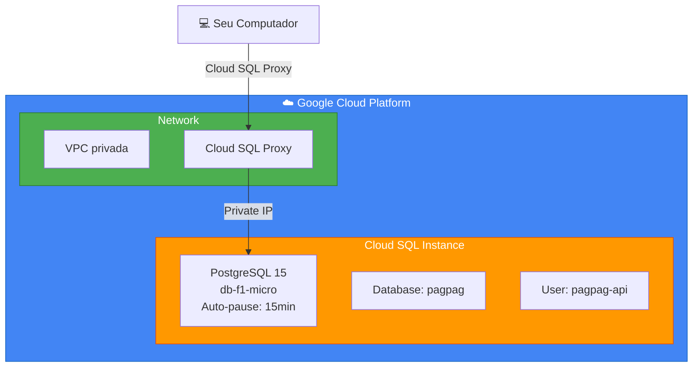

# 🗄️ Guia de Criação do PostgreSQL no GCP

> **Documento:** Setup Cloud SQL PostgreSQL
> 
> **Projeto:** Pag Pag (Neves Capital)
> 
> **Data:** Outubro 2025
> 
> **Objetivo:** Criar banco PostgreSQL com auto-pause para desenvolvimento

---

## 📋 Índice

1. [Visão Geral](#visão-geral)
2. [Pré-requisitos](#pré-requisitos)
3. [Passo 1: Configurar GCP](#passo-1-configurar-gcp)
4. [Passo 2: Criar Instância Cloud SQL](#passo-2-criar-instância-cloud-sql)
5. [Passo 3: Configurar Conexão](#passo-3-configurar-conexão)
6. [Passo 4: Criar Schema](#passo-4-criar-schema)
7. [Passo 5: Configurar Auto-Pause](#passo-5-configurar-auto-pause)
8. [Estimativa de Custos](#estimativa-de-custos)
9. [Troubleshooting](#troubleshooting)

---

## 🎯 Visão Geral

### O que vamos criar



### Características da Instância

| Configuração | Valor | Justificativa |
|--------------|-------|---------------|
| **Versão** | PostgreSQL 15 | Mais recente, melhor performance |
| **Tier** | db-f1-micro | Menor custo, adequado para dev |
| **vCPU** | 1 shared | Suficiente para desenvolvimento |
| **RAM** | 0.6 GB | Adequado para baixo volume |
| **Storage** | 10 GB SSD | Espaço inicial |
| **Auto-pause** | 15 minutos inativo | **Economia de 80-90%** |
| **Backup** | Diário às 3:00 AM | 7 dias de retenção |
| **Region** | southamerica-east1 (São Paulo) | Menor latência |

---

## 🔧 Pré-requisitos

### 1. Criar Conta Google Cloud

```bash
# 1. Acesse o console
open https://console.cloud.google.com

# 2. Criar conta ou fazer login
# - Você ganhará $300 de créditos grátis por 90 dias
# - Não será cobrado sem sua autorização explícita

# 3. Adicionar forma de pagamento
# Settings > Billing > Add payment method
# (Necessário mesmo com créditos grátis)
```

### 2. Instalar Google Cloud SDK

```bash
# macOS
brew install --cask google-cloud-sdk

# Verificar instalação
gcloud --version
# Deve mostrar: Google Cloud SDK 450.0.0+

# Inicializar
gcloud init

# Seguir instruções:
# 1. Fazer login com sua conta Google
# 2. Selecionar ou criar projeto
# 3. Selecionar região padrão: southamerica-east1
```

### 3. Instalar PostgreSQL Client (local)

```bash
# macOS
brew install postgresql@15

# Verificar instalação
psql --version
# Deve mostrar: psql (PostgreSQL) 15.x

# Adicionar ao PATH
echo 'export PATH="/opt/homebrew/opt/postgresql@15/bin:$PATH"' >> ~/.zshrc
source ~/.zshrc
```

### 4. Instalar Cloud SQL Proxy

```bash
# macOS (Apple Silicon - M1/M2/M3)
curl -o cloud-sql-proxy https://storage.googleapis.com/cloud-sql-connectors/cloud-sql-proxy/v2.8.0/cloud-sql-proxy.darwin.arm64

# macOS (Intel)
curl -o cloud-sql-proxy https://storage.googleapis.com/cloud-sql-connectors/cloud-sql-proxy/v2.8.0/cloud-sql-proxy.darwin.amd64

# Dar permissão de execução
chmod +x cloud-sql-proxy

# Mover para pasta global
sudo mv cloud-sql-proxy /usr/local/bin/

# Verificar
cloud-sql-proxy --version
```

---

## 🚀 Passo 1: Configurar GCP

### 1.1 Criar Projeto

```bash
# Criar projeto para desenvolvimento
gcloud projects create pag-pag-dev \
  --name="Pag Pag Development" \
  --set-as-default

# Verificar projeto criado
gcloud projects list

# Definir como projeto padrão (se não foi automaticamente)
gcloud config set project pag-pag-dev
```

### 1.2 Vincular Billingconfig 

```bash
# Listar contas de billing
gcloud billing accounts list

# Output exemplo:
# ACCOUNT_ID          NAME                OPEN  MASTER_ACCOUNT_ID
# 01234-56789-ABCDEF  My Billing Account  True

# Vincular billing ao projeto
gcloud billing projects link pag-pag-dev \
  --billing-account=01234-56789-ABCDEF
```

### 1.3 Habilitar APIs Necessárias

```bash
# Habilitar API do Cloud SQL
gcloud services enable sqladmin.googleapis.com

# Habilitar API de Compute (para networking)
gcloud services enable compute.googleapis.com

# Habilitar API de Service Networking
gcloud services enable servicenetworking.googleapis.com

# Habilitar Secret Manager (para senhas)
gcloud services enable secretmanager.googleapis.com

# Verificar APIs habilitadas
gcloud services list --enabled | grep -E 'sqladmin|compute|servicenetworking'
```

### 1.4 Configurar Budget Alert

```bash
# Criar alerta de orçamento (importante!)
gcloud billing budgets create \
  --billing-account=01234-56789-ABCDEF \
  --display-name="Pag Pag Dev Monthly Budget" \
  --budget-amount=50BRL \
  --threshold-rule=percent=50 \
  --threshold-rule=percent=90 \
  --threshold-rule=percent=100

# Você receberá email quando atingir 50%, 90% e 100% do budget
```

---

## 🗄️ Passo 2: Criar Instância Cloud SQL

### 2.1 Criar Instância via Console (Recomendado para primeira vez)

```bash
# Abrir console do Cloud SQL
open https://console.cloud.google.com/sql/instances

# Ou via comando direto:
gcloud sql instances create pagpag-db-dev \
  --database-version=POSTGRES_15 \
  --tier=db-f1-micro \
  --region=southamerica-east1 \
  --availability-type=zonal \
  --storage-type=SSD \
  --storage-size=10GB \
  --storage-auto-increase \
  --storage-auto-increase-limit=20 \
  --backup-start-time=03:00 \
  --retained-backups-count=7 \
  --enable-bin-log=false \
  --maintenance-window-day=SUN \
  --maintenance-window-hour=04 \
  --deletion-protection \
  --root-password=$(openssl rand -base64 32)

# Este comando leva ~5-10 minutos para completar
```

### 2.2 Opção: Criar via Console Web (Passo a Passo)

#### 📸 **Tutorial Visual:**

1. **Acessar Cloud SQL**
   ```
   https://console.cloud.google.com/sql/instances
   → Clicar em "CREATE INSTANCE"
   ```

2. **Escolher PostgreSQL**
   ```
   → Clicar em "Choose PostgreSQL"
   ```

3. **Configurações Básicas**
   ```
   Instance ID: pagpag-db-dev
   Password: [Gerar senha forte - salvar!]
   Database version: PostgreSQL 15
   Region: southamerica-east1 (São Paulo)
   Zonal availability: Single zone
   ```

4. **Configurações de Máquina**
   ```
   → Expandir "Show configuration options"
   
   Machine type:
   → Shared core
   → db-f1-micro (1 vCPU, 0.6 GB)
   
   Storage:
   → Storage type: SSD
   → Storage capacity: 10 GB
   → Enable automatic storage increases: ✅
   → Storage limit: 20 GB
   ```

5. **Conexões**
   ```
   → Public IP: ✅ (por enquanto, para facilitar setup)
   → Private IP: ⬜ (configurar depois)
   
   Authorized networks:
   → Add network
   → Name: "My Computer"
   → Network: [Seu IP público - veja em https://whatismyip.com]
   → Adicionar: /32 (ex: 200.100.50.25/32)
   ```

6. **Backups e Manutenção**
   ```
   Automated backups:
   → Enable automated backups: ✅
   → Backup window: 03:00 - 04:00
   → Retention: 7 backups
   
   Point-in-time recovery: ⬜ (não necessário para dev)
   
   Maintenance window:
   → Day: Sunday
   → Hour: 04:00
   ```

7. **Flags (Importante para Auto-Pause)**
   ```
   → Expandir "Flags"
   → Add item
   
   Flag: cloudsql.enable_auto_suspend
   Value: on
   
   Flag: cloudsql.auto_suspend_timeout
   Value: 900 (15 minutos em segundos)
   ```

8. **Criar Instância**
   ```
   → Revisar configurações
   → Clicar em "CREATE INSTANCE"
   → Aguardar ~5-10 minutos
   ```

### 2.3 Salvar Credenciais de Forma Segura

```bash
# Criar arquivo .env local (NÃO commitar no git)
cat > .env.local <<EOF
# Cloud SQL Development
DB_INSTANCE_CONNECTION_NAME=pag-pag-dev:southamerica-east1:pagpag-db-dev
DB_HOST=127.0.0.1
DB_PORT=5432
DB_NAME=postgres
DB_USER=postgres
DB_PASSWORD=SUA_SENHA_AQUI
DB_DATABASE=pagpag
EOF

# Adicionar ao .gitignore
echo ".env.local" >> .gitignore

# Salvar também no Secret Manager (seguro)
echo -n "SUA_SENHA_AQUI" | gcloud secrets create db-root-password \
  --data-file=- \
  --replication-policy=automatic

# Confirmar
gcloud secrets versions access latest --secret=db-root-password
```

---

## 🔌 Passo 3: Configurar Conexão

### 3.1 Obter Connection Name

```bash
# Obter o connection name completo
gcloud sql instances describe pagpag-db-dev \
  --format='value(connectionName)'

# Output exemplo:
# pag-pag-dev:southamerica-east1:pagpag-db-dev

# Salvar em variável
export DB_CONNECTION_NAME=$(gcloud sql instances describe pagpag-db-dev --format='value(connectionName)')
echo $DB_CONNECTION_NAME
```

### 3.2 Conectar via Cloud SQL Proxy

```bash
# Terminal 1: Iniciar Cloud SQL Proxy
cloud-sql-proxy $DB_CONNECTION_NAME \
  --port=5432 \
  --credentials-file=~/.config/gcloud/application_default_credentials.json

# Output esperado:
# Listening on 127.0.0.1:5432
# The proxy has started successfully and is ready for new connections!

# Deixar este terminal rodando
```

```bash
# Terminal 2: Testar conexão
psql "host=127.0.0.1 port=5432 user=postgres dbname=postgres sslmode=disable"

# Digitar a senha quando solicitado

# Se conectou com sucesso, você verá:
# postgres=>

# Testar comando
postgres=> SELECT version();
postgres=> \q  # Sair
```

### 3.3 Criar Database e Usuário

```bash
# Conectar como postgres
psql "host=127.0.0.1 port=5432 user=postgres dbname=postgres"
```

```sql
-- 1. Criar database
CREATE DATABASE pagpag
  WITH 
  ENCODING = 'UTF8'
  LC_COLLATE = 'en_US.UTF-8'
  LC_CTYPE = 'en_US.UTF-8'
  TEMPLATE = template0;

-- 2. Criar usuário para a aplicação
CREATE USER pagpag_api WITH PASSWORD 'sua_senha_forte_aqui';

-- 3. Dar permissões
GRANT ALL PRIVILEGES ON DATABASE pagpag TO pagpag_api;

-- 4. Conectar ao database pagpag
\c pagpag

-- 5. Dar permissões no schema public
GRANT ALL ON SCHEMA public TO pagpag_api;
GRANT ALL ON ALL TABLES IN SCHEMA public TO pagpag_api;
GRANT ALL ON ALL SEQUENCES IN SCHEMA public TO pagpag_api;
ALTER DEFAULT PRIVILEGES IN SCHEMA public GRANT ALL ON TABLES TO pagpag_api;
ALTER DEFAULT PRIVILEGES IN SCHEMA public GRANT ALL ON SEQUENCES TO pagpag_api;

-- 6. Verificar
\l  -- Listar databases
\du -- Listar usuários

-- Sair
\q
```

```bash
# Salvar senha do usuário no Secret Manager
echo -n "sua_senha_forte_aqui" | gcloud secrets create db-api-password \
  --data-file=- \
  --replication-policy=automatic
```

---

## 📝 Passo 4: Criar Schema

### 4.1 Criar Arquivo de Schema

```bash
# Criar diretório para scripts SQL
mkdir -p /Users/wagneralves/StudioProjects/neves_capital/database

# Criar arquivo de schema
cat > /Users/wagneralves/StudioProjects/neves_capital/database/schema.sql <<'EOF'
-- ================================================
-- PAG PAG - DATABASE SCHEMA
-- PostgreSQL 15
-- ================================================

-- 1. EXTENSÕES
-- ================================================
CREATE EXTENSION IF NOT EXISTS "uuid-ossp";
CREATE EXTENSION IF NOT EXISTS "pgcrypto";

-- 2. TABELA: users
-- ================================================
CREATE TABLE IF NOT EXISTS users (
    id UUID PRIMARY KEY DEFAULT uuid_generate_v4(),
    
    -- Dados Pessoais (criptografados)
    full_name VARCHAR(255) NOT NULL,
    cpf_encrypted BYTEA NOT NULL UNIQUE,
    email_encrypted BYTEA NOT NULL,
    
    -- KYC - Documentos
    registration_photo_url TEXT,
    id_document_url TEXT,
    
    -- Firebase Auth
    firebase_uid VARCHAR(128) UNIQUE,
    
    -- KYC Status
    kyc_status VARCHAR(20) DEFAULT 'pending' CHECK (kyc_status IN ('pending', 'in_progress', 'approved', 'rejected')),
    kyc_verified_at TIMESTAMP,
    
    -- Auditoria
    created_at TIMESTAMP DEFAULT NOW(),
    updated_at TIMESTAMP DEFAULT NOW(),
    deleted_at TIMESTAMP
);

-- Índices
CREATE INDEX IF NOT EXISTS idx_users_firebase_uid ON users(firebase_uid);
CREATE INDEX IF NOT EXISTS idx_users_created_at ON users(created_at DESC);
CREATE INDEX IF NOT EXISTS idx_users_deleted_at ON users(deleted_at) WHERE deleted_at IS NULL;
CREATE INDEX IF NOT EXISTS idx_users_kyc_status ON users(kyc_status);

-- Comentários
COMMENT ON TABLE users IS 'Tabela principal de usuários (dados base)';
COMMENT ON COLUMN users.full_name IS 'Nome completo do usuário';
COMMENT ON COLUMN users.cpf_encrypted IS 'CPF criptografado com AES-256 (ÚNICO)';
COMMENT ON COLUMN users.email_encrypted IS 'Email criptografado com AES-256';
COMMENT ON COLUMN users.registration_photo_url IS 'URL da foto do cadastro (Cloud Storage)';
COMMENT ON COLUMN users.id_document_url IS 'URL do documento de identificação (Cloud Storage)';
COMMENT ON COLUMN users.firebase_uid IS 'UID do Firebase Authentication';
COMMENT ON COLUMN users.kyc_status IS 'Status da verificação KYC';

-- 3. TABELA: user_phones
-- ================================================
CREATE TABLE IF NOT EXISTS user_phones (
    id UUID PRIMARY KEY DEFAULT uuid_generate_v4(),
    user_id UUID NOT NULL REFERENCES users(id) ON DELETE CASCADE,
    phone_encrypted BYTEA NOT NULL,
    phone_type VARCHAR(20) DEFAULT 'mobile' CHECK (phone_type IN ('mobile', 'home', 'work', 'other')),
    is_primary BOOLEAN DEFAULT FALSE,
    is_verified BOOLEAN DEFAULT FALSE,
    verified_at TIMESTAMP,
    created_at TIMESTAMP DEFAULT NOW(),
    updated_at TIMESTAMP DEFAULT NOW()
);

-- Índices
CREATE INDEX IF NOT EXISTS idx_phones_user_id ON user_phones(user_id);
CREATE INDEX IF NOT EXISTS idx_phones_primary ON user_phones(user_id, is_primary) WHERE is_primary = TRUE;

-- Comentários
COMMENT ON TABLE user_phones IS 'Telefones dos usuários (múltiplos por usuário)';
COMMENT ON COLUMN user_phones.phone_encrypted IS 'Telefone criptografado com AES-256';
COMMENT ON COLUMN user_phones.phone_type IS 'Tipo: mobile, home, work, other';
COMMENT ON COLUMN user_phones.is_primary IS 'Se é o telefone principal';

-- 4. TABELA: user_addresses
-- ================================================
CREATE TABLE IF NOT EXISTS user_addresses (
    id UUID PRIMARY KEY DEFAULT uuid_generate_v4(),
    user_id UUID NOT NULL REFERENCES users(id) ON DELETE CASCADE,
    
    -- Endereço completo (criptografado)
    street_encrypted BYTEA NOT NULL,
    number_encrypted BYTEA,
    complement_encrypted BYTEA,
    neighborhood_encrypted BYTEA,
    city_encrypted BYTEA NOT NULL,
    state_encrypted BYTEA NOT NULL,
    cep VARCHAR(9) NOT NULL,
    country VARCHAR(2) DEFAULT 'BR',
    
    -- Metadados
    address_type VARCHAR(20) DEFAULT 'residential' CHECK (address_type IN ('residential', 'commercial', 'billing', 'shipping', 'other')),
    is_primary BOOLEAN DEFAULT FALSE,
    
    created_at TIMESTAMP DEFAULT NOW(),
    updated_at TIMESTAMP DEFAULT NOW()
);

-- Índices
CREATE INDEX IF NOT EXISTS idx_addresses_user_id ON user_addresses(user_id);
CREATE INDEX IF NOT EXISTS idx_addresses_cep ON user_addresses(cep);
CREATE INDEX IF NOT EXISTS idx_addresses_primary ON user_addresses(user_id, is_primary) WHERE is_primary = TRUE;

-- Comentários
COMMENT ON TABLE user_addresses IS 'Endereços dos usuários (múltiplos por usuário)';
COMMENT ON COLUMN user_addresses.cep IS 'CEP do endereço';
COMMENT ON COLUMN user_addresses.address_type IS 'Tipo: residential, commercial, billing, shipping, other';
COMMENT ON COLUMN user_addresses.is_primary IS 'Se é o endereço principal';

-- 5. TABELA: user_bank_accounts
-- ================================================
CREATE TABLE IF NOT EXISTS user_bank_accounts (
    id UUID PRIMARY KEY DEFAULT uuid_generate_v4(),
    user_id UUID NOT NULL REFERENCES users(id) ON DELETE CASCADE,
    
    -- Dados bancários (criptografados)
    bank_code VARCHAR(10),
    bank_name VARCHAR(100),
    agency_encrypted BYTEA NOT NULL,
    account_encrypted BYTEA NOT NULL,
    account_type VARCHAR(20) CHECK (account_type IN ('corrente', 'poupanca', 'salario', 'pagamento')),
    holder_name_encrypted BYTEA NOT NULL,
    holder_cpf_encrypted BYTEA NOT NULL,
    
    -- PIX
    pix_key_type VARCHAR(20) CHECK (pix_key_type IN ('cpf', 'email', 'phone', 'random')),
    pix_key_encrypted BYTEA,
    
    -- Metadados
    is_primary BOOLEAN DEFAULT FALSE,
    is_verified BOOLEAN DEFAULT FALSE,
    verified_at TIMESTAMP,
    
    created_at TIMESTAMP DEFAULT NOW(),
    updated_at TIMESTAMP DEFAULT NOW()
);

-- Índices
CREATE INDEX IF NOT EXISTS idx_bank_accounts_user_id ON user_bank_accounts(user_id);
CREATE INDEX IF NOT EXISTS idx_bank_accounts_primary ON user_bank_accounts(user_id, is_primary) WHERE is_primary = TRUE;

-- Comentários
COMMENT ON TABLE user_bank_accounts IS 'Contas bancárias dos usuários (múltiplas por usuário)';
COMMENT ON COLUMN user_bank_accounts.account_type IS 'Tipo: corrente, poupanca, salario, pagamento';
COMMENT ON COLUMN user_bank_accounts.pix_key_type IS 'Tipo da chave PIX: cpf, email, phone, random';
COMMENT ON COLUMN user_bank_accounts.is_primary IS 'Se é a conta principal para recebimentos';

-- 6. TABELA: kyc_documents
-- ================================================
CREATE TABLE IF NOT EXISTS kyc_documents (
    id UUID PRIMARY KEY DEFAULT uuid_generate_v4(),
    user_id UUID NOT NULL REFERENCES users(id) ON DELETE CASCADE,
    document_type VARCHAR(50) NOT NULL CHECK (document_type IN ('rg_front', 'rg_back', 'cnh', 'selfie', 'proof_of_address')),
    storage_url_encrypted BYTEA NOT NULL,
    status VARCHAR(20) DEFAULT 'pending' CHECK (status IN ('pending', 'approved', 'rejected')),
    uploaded_at TIMESTAMP DEFAULT NOW(),
    verified_at TIMESTAMP,
    rejection_reason TEXT
);

-- Índices
CREATE INDEX IF NOT EXISTS idx_kyc_user_id ON kyc_documents(user_id);
CREATE INDEX IF NOT EXISTS idx_kyc_status ON kyc_documents(status);
CREATE INDEX IF NOT EXISTS idx_kyc_document_type ON kyc_documents(document_type);

-- Comentários
COMMENT ON TABLE kyc_documents IS 'Documentos enviados para verificação KYC';
COMMENT ON COLUMN kyc_documents.document_type IS 'Tipo: rg_front, rg_back, cnh, selfie, proof_of_address';

-- 7. TABELA: transactions
-- ================================================
CREATE TABLE IF NOT EXISTS transactions (
    id UUID PRIMARY KEY DEFAULT uuid_generate_v4(),
    user_id UUID NOT NULL REFERENCES users(id),
    
    -- Valores da Venda
    gross_amount NUMERIC(12, 2) NOT NULL CHECK (gross_amount > 0),
    net_amount NUMERIC(12, 2) NOT NULL CHECK (net_amount > 0),
    fee_amount NUMERIC(12, 2) DEFAULT 0,
    
    currency VARCHAR(3) DEFAULT 'BRL' CHECK (currency IN ('BRL', 'USD', 'EUR')),
    status VARCHAR(20) NOT NULL CHECK (status IN ('pending', 'processing', 'succeeded', 'failed', 'refunded')),
    
    -- Stripe
    metadata JSONB,
    stripe_payment_id VARCHAR(255) UNIQUE,
    stripe_payment_intent_id VARCHAR(255),
    
    -- Data e horário da venda
    sale_date TIMESTAMP DEFAULT NOW(),
    created_at TIMESTAMP DEFAULT NOW(),
    updated_at TIMESTAMP DEFAULT NOW()
);

-- Índices
CREATE INDEX IF NOT EXISTS idx_transactions_user_id ON transactions(user_id, created_at DESC);
CREATE INDEX IF NOT EXISTS idx_transactions_status ON transactions(status);
CREATE INDEX IF NOT EXISTS idx_transactions_stripe ON transactions(stripe_payment_id);
CREATE INDEX IF NOT EXISTS idx_transactions_metadata ON transactions USING GIN (metadata);
CREATE INDEX IF NOT EXISTS idx_transactions_sale_date ON transactions(sale_date DESC);

-- Comentários
COMMENT ON TABLE transactions IS 'Histórico de transações financeiras com dados de venda';
COMMENT ON COLUMN transactions.gross_amount IS 'Valor Bruto da Venda (antes das taxas)';
COMMENT ON COLUMN transactions.net_amount IS 'Valor Líquido da Venda (após taxas)';
COMMENT ON COLUMN transactions.fee_amount IS 'Valor das taxas (Stripe + outras)';
COMMENT ON COLUMN transactions.sale_date IS 'Data e horário de cada venda';
COMMENT ON COLUMN transactions.status IS 'Status: pending, processing, succeeded, failed, refunded';

-- 8. TABELA: payment_methods
-- ================================================
CREATE TABLE IF NOT EXISTS payment_methods (
    id UUID PRIMARY KEY DEFAULT uuid_generate_v4(),
    user_id UUID NOT NULL REFERENCES users(id) ON DELETE CASCADE,
    type VARCHAR(20) NOT NULL CHECK (type IN ('card', 'pix', 'boleto')),
    last_four VARCHAR(4),
    brand VARCHAR(20),
    is_default BOOLEAN DEFAULT FALSE,
    stripe_payment_method_id VARCHAR(255),
    created_at TIMESTAMP DEFAULT NOW()
);

-- Índices
CREATE INDEX IF NOT EXISTS idx_payment_methods_user_id ON payment_methods(user_id);
CREATE INDEX IF NOT EXISTS idx_payment_methods_default ON payment_methods(user_id, is_default) WHERE is_default = TRUE;

-- Comentários
COMMENT ON TABLE payment_methods IS 'Métodos de pagamento salvos dos usuários';

-- 9. TABELA: audit_log
-- ================================================
CREATE TABLE IF NOT EXISTS audit_log (
    id BIGSERIAL PRIMARY KEY,
    user_id UUID REFERENCES users(id),
    action VARCHAR(50) NOT NULL,
    table_name VARCHAR(50) NOT NULL,
    record_id UUID,
    old_data JSONB,
    new_data JSONB,
    ip_address INET,
    user_agent TEXT,
    created_at TIMESTAMP DEFAULT NOW()
);

-- Índices
CREATE INDEX IF NOT EXISTS idx_audit_user_id ON audit_log(user_id, created_at DESC);
CREATE INDEX IF NOT EXISTS idx_audit_table ON audit_log(table_name, created_at DESC);
CREATE INDEX IF NOT EXISTS idx_audit_action ON audit_log(action);
CREATE INDEX IF NOT EXISTS idx_audit_created_at ON audit_log(created_at DESC);

-- Comentários
COMMENT ON TABLE audit_log IS 'Log de auditoria de todas as operações';

-- 8. TRIGGER: updated_at automático
-- ================================================
CREATE OR REPLACE FUNCTION update_updated_at_column()
RETURNS TRIGGER AS $$
BEGIN
    NEW.updated_at = NOW();
    RETURN NEW;
END;
$$ LANGUAGE plpgsql;

-- Aplicar trigger em todas as tabelas relevantes
CREATE TRIGGER update_users_updated_at 
    BEFORE UPDATE ON users
    FOR EACH ROW 
    EXECUTE FUNCTION update_updated_at_column();

CREATE TRIGGER update_phones_updated_at 
    BEFORE UPDATE ON user_phones
    FOR EACH ROW 
    EXECUTE FUNCTION update_updated_at_column();

CREATE TRIGGER update_addresses_updated_at 
    BEFORE UPDATE ON user_addresses
    FOR EACH ROW 
    EXECUTE FUNCTION update_updated_at_column();

CREATE TRIGGER update_bank_accounts_updated_at 
    BEFORE UPDATE ON user_bank_accounts
    FOR EACH ROW 
    EXECUTE FUNCTION update_updated_at_column();

CREATE TRIGGER update_transactions_updated_at 
    BEFORE UPDATE ON transactions
    FOR EACH ROW 
    EXECUTE FUNCTION update_updated_at_column();

-- 9. FUNÇÕES UTILITÁRIAS
-- ================================================

-- Função para buscar usuário por CPF (usado pela API)
CREATE OR REPLACE FUNCTION get_user_by_cpf(encrypted_cpf BYTEA)
RETURNS TABLE (
    id UUID,
    email_encrypted BYTEA,
    firebase_uid VARCHAR,
    created_at TIMESTAMP
) AS $$
BEGIN
    RETURN QUERY
    SELECT u.id, u.email_encrypted, u.firebase_uid, u.created_at
    FROM users u
    WHERE u.cpf_encrypted = encrypted_cpf
    AND u.deleted_at IS NULL;
END;
$$ LANGUAGE plpgsql;

-- Função para estatísticas de transações
CREATE OR REPLACE FUNCTION get_user_transaction_stats(p_user_id UUID)
RETURNS TABLE (
    total_transactions BIGINT,
    total_amount NUMERIC,
    succeeded_count BIGINT,
    failed_count BIGINT,
    avg_amount NUMERIC
) AS $$
BEGIN
    RETURN QUERY
    SELECT 
        COUNT(*)::BIGINT,
        COALESCE(SUM(amount), 0),
        COUNT(*) FILTER (WHERE status = 'succeeded')::BIGINT,
        COUNT(*) FILTER (WHERE status = 'failed')::BIGINT,
        COALESCE(AVG(amount), 0)
    FROM transactions
    WHERE user_id = p_user_id;
END;
$$ LANGUAGE plpgsql;

-- 10. ROW LEVEL SECURITY (opcional, para multi-tenant futuro)
-- ================================================
-- Comentado por enquanto, descomentar quando necessário

-- ALTER TABLE users ENABLE ROW LEVEL SECURITY;
-- ALTER TABLE user_phones ENABLE ROW LEVEL SECURITY;
-- ALTER TABLE user_addresses ENABLE ROW LEVEL SECURITY;
-- ALTER TABLE user_bank_accounts ENABLE ROW LEVEL SECURITY;
-- ALTER TABLE kyc_documents ENABLE ROW LEVEL SECURITY;
-- ALTER TABLE transactions ENABLE ROW LEVEL SECURITY;
-- ALTER TABLE payment_methods ENABLE ROW LEVEL SECURITY;

-- 11. VIEWS
-- ================================================

-- View para dashboard de usuários
CREATE OR REPLACE VIEW v_user_dashboard AS
SELECT 
    u.id,
    u.firebase_uid,
    u.full_name,
    u.created_at,
    u.kyc_status,
    COUNT(DISTINCT t.id) as total_transactions,
    COALESCE(SUM(t.gross_amount) FILTER (WHERE t.status = 'succeeded'), 0) as total_gross,
    COALESCE(SUM(t.net_amount) FILTER (WHERE t.status = 'succeeded'), 0) as total_net,
    COUNT(DISTINCT pm.id) as payment_methods_count,
    COUNT(DISTINCT ph.id) as phones_count,
    COUNT(DISTINCT addr.id) as addresses_count,
    COUNT(DISTINCT ba.id) as bank_accounts_count
FROM users u
LEFT JOIN transactions t ON u.id = t.user_id
LEFT JOIN payment_methods pm ON u.id = pm.user_id
LEFT JOIN user_phones ph ON u.id = ph.user_id
LEFT JOIN user_addresses addr ON u.id = addr.user_id
LEFT JOIN user_bank_accounts ba ON u.id = ba.user_id
WHERE u.deleted_at IS NULL
GROUP BY u.id, u.firebase_uid, u.full_name, u.created_at, u.kyc_status;

-- View para transações recentes
CREATE OR REPLACE VIEW v_recent_transactions AS
SELECT 
    t.id,
    t.user_id,
    u.full_name as user_name,
    t.gross_amount,
    t.net_amount,
    t.fee_amount,
    t.currency,
    t.status,
    t.sale_date,
    t.created_at
FROM transactions t
JOIN users u ON t.user_id = u.id
WHERE u.deleted_at IS NULL
ORDER BY t.sale_date DESC
LIMIT 100;

-- 12. SEED DATA (apenas para desenvolvimento)
-- ================================================
-- Comentado por segurança, descomentar apenas localmente

-- INSERT INTO users (cpf_encrypted, email_encrypted, phone_encrypted, firebase_uid)
-- VALUES (
--     decrypt(E'\\x...', 'encryption_key', 'aes'),
--     decrypt(E'\\x...', 'encryption_key', 'aes'),
--     decrypt(E'\\x...', 'encryption_key', 'aes'),
--     'test-firebase-uid-123'
-- );

-- ================================================
-- FIM DO SCHEMA
-- ================================================

-- Verificar tabelas criadas
SELECT 
    schemaname,
    tablename,
    tableowner
FROM pg_tables 
WHERE schemaname = 'public'
ORDER BY tablename;

-- Verificar extensões
SELECT * FROM pg_extension;

-- Verificar triggers
SELECT 
    trigger_name,
    event_object_table,
    action_statement
FROM information_schema.triggers
WHERE trigger_schema = 'public';
EOF
```

### 4.2 Aplicar Schema

```bash
# Conectar via Cloud SQL Proxy (certifique-se que está rodando)
# Terminal 1: cloud-sql-proxy ...

# Terminal 2: Aplicar schema
psql "host=127.0.0.1 port=5432 user=pagpag_api dbname=pagpag" \
  -f /Users/wagneralves/StudioProjects/neves_capital/database/schema.sql

# Output esperado:
# CREATE EXTENSION
# CREATE EXTENSION
# CREATE TABLE
# CREATE INDEX
# ...
# (várias mensagens de sucesso)
```

### 4.3 Verificar Schema Criado

```bash
# Conectar ao database
psql "host=127.0.0.1 port=5432 user=pagpag_api dbname=pagpag"
```

```sql
-- Listar todas as tabelas
\dt

-- Output esperado:
--              List of relations
--  Schema |       Name         | Type  |   Owner    
-- --------+--------------------+-------+------------
--  public | audit_log          | table | pagpag_api
--  public | kyc_documents      | table | pagpag_api
--  public | payment_methods    | table | pagpag_api
--  public | transactions       | table | pagpag_api
--  public | user_addresses     | table | pagpag_api
--  public | user_bank_accounts | table | pagpag_api
--  public | user_phones        | table | pagpag_api
--  public | users              | table | pagpag_api

-- Ver estrutura de uma tabela
\d users

-- Ver views
\dv

-- Ver funções
\df

-- Testar função
SELECT * FROM get_user_transaction_stats('00000000-0000-0000-0000-000000000000');

-- Sair
\q
```

---

## ⏸️ Passo 5: Configurar Auto-Pause

### 5.1 Habilitar Auto-Suspend

```bash
# Listar flags atuais da instância
gcloud sql instances describe pagpag-db-dev \
  --format='value(settings.databaseFlags)'

# Configurar auto-suspend via gcloud
gcloud sql instances patch pagpag-db-dev \
  --database-flags=cloudsql.enable_auto_suspend=on,cloudsql.auto_suspend_timeout=900

# Aguardar aplicação das mudanças (~2-3 minutos)
```

### 5.2 Verificar Status

```bash
# Ver estado atual da instância
gcloud sql instances describe pagpag-db-dev \
  --format='value(state)'

# Possíveis estados:
# - RUNNABLE: Rodando normalmente
# - SUSPENDED: Em pausa (economizando dinheiro!)
# - PENDING_CREATE: Sendo criado
# - MAINTENANCE: Em manutenção

# Ver última vez que foi acessado
gcloud sql operations list \
  --instance=pagpag-db-dev \
  --limit=5
```

### 5.3 Script de Ativação Rápida

```bash
# Criar script para "acordar" o banco rapidamente
cat > /Users/wagneralves/StudioProjects/neves_capital/scripts/wake-db.sh <<'EOF'
#!/bin/bash

# Script para ativar Cloud SQL rapidamente
echo "🔄 Ativando Cloud SQL..."

# Fazer uma query simples para "acordar" o banco
gcloud sql operations list --instance=pagpag-db-dev --limit=1 > /dev/null

echo "⏳ Aguardando banco ficar disponível..."
while [ "$(gcloud sql instances describe pagpag-db-dev --format='value(state)')" != "RUNNABLE" ]; do
    echo -n "."
    sleep 2
done

echo ""
echo "✅ Cloud SQL está ativo e pronto!"
echo "💡 Você pode conectar via Cloud SQL Proxy"
EOF

chmod +x /Users/wagneralves/StudioProjects/neves_capital/scripts/wake-db.sh

# Usar:
# ./scripts/wake-db.sh
```

### 5.4 Script de Conexão Automática

```bash
# Criar script que inicia proxy e conecta
cat > /Users/wagneralves/StudioProjects/neves_capital/scripts/connect-db.sh <<'EOF'
#!/bin/bash

# Script para conectar ao banco rapidamente

# Verificar se Cloud SQL Proxy já está rodando
if pgrep -f "cloud-sql-proxy.*pagpag-db-dev" > /dev/null; then
    echo "✅ Cloud SQL Proxy já está rodando"
else
    echo "🚀 Iniciando Cloud SQL Proxy..."
    cloud-sql-proxy pag-pag-dev:southamerica-east1:pagpag-db-dev \
      --port=5432 &
    
    # Aguardar proxy iniciar
    sleep 3
fi

# Conectar ao banco
echo "🔌 Conectando ao banco..."
psql "host=127.0.0.1 port=5432 user=pagpag_api dbname=pagpag sslmode=disable"
EOF

chmod +x /Users/wagneralves/StudioProjects/neves_capital/scripts/connect-db.sh

# Usar:
# ./scripts/connect-db.sh
```

---

## 💰 Estimativa de Custos

### Configuração Detalhada

| Componente | Especificação | Custo Unitário (BRL) | Período |
|------------|--------------|---------------------|---------|
| **Instância db-f1-micro** | 1 vCPU shared, 0.6 GB RAM | R$ 0,017/hora | Quando ativa |
| **Storage SSD** | 10 GB | R$ 0,17/GB/mês | Sempre |
| **Backup** | 10 GB (igual ao storage) | R$ 0,026/GB/mês | Sempre |
| **Egress (saída de dados)** | Primeiros 1 GB/mês | R$ 0,00 | Grátis |
| **Egress adicional** | Por GB | R$ 0,12/GB | Se exceder 1 GB |

### Cenários de Uso

#### 🟢 **Cenário 1: Desenvolvimento (8h/dia, 20 dias/mês)**

```
Instância ATIVA:
├─ 8 horas/dia × 20 dias = 160 horas/mês
├─ 160h × R$ 0,017/h = R$ 2,72/mês
│
Storage SSD:
├─ 10 GB × R$ 0,17/GB = R$ 1,70/mês
│
Backup:
├─ 10 GB × R$ 0,026/GB = R$ 0,26/mês
│
Egress:
├─ < 1 GB/mês = R$ 0,00
│
─────────────────────────────────────
TOTAL: R$ 4,68/mês 💰
```

#### 🟡 **Cenário 2: Desenvolvimento Intenso (12h/dia, 25 dias/mês)**

```
Instância ATIVA:
├─ 12 horas/dia × 25 dias = 300 horas/mês
├─ 300h × R$ 0,017/h = R$ 5,10/mês
│
Storage SSD:
├─ 10 GB × R$ 0,17/GB = R$ 1,70/mês
│
Backup:
├─ 10 GB × R$ 0,026/GB = R$ 0,26/mês
│
Egress:
├─ < 1 GB/mês = R$ 0,00
│
─────────────────────────────────────
TOTAL: R$ 7,06/mês 💰
```

#### 🔵 **Cenário 3: Uso Mínimo (4h/dia, 15 dias/mês)**

```
Instância ATIVA:
├─ 4 horas/dia × 15 dias = 60 horas/mês
├─ 60h × R$ 0,017/h = R$ 1,02/mês
│
Storage SSD:
├─ 10 GB × R$ 0,17/GB = R$ 1,70/mês
│
Backup:
├─ 10 GB × R$ 0,026/GB = R$ 0,26/mês
│
Egress:
├─ < 1 GB/mês = R$ 0,00
│
─────────────────────────────────────
TOTAL: R$ 2,98/mês 💰
```

#### 🔴 **Cenário 4: 24/7 (sem auto-pause)**

```
Instância ATIVA:
├─ 24 horas/dia × 30 dias = 720 horas/mês
├─ 720h × R$ 0,017/h = R$ 12,24/mês
│
Storage SSD:
├─ 10 GB × R$ 0,17/GB = R$ 1,70/mês
│
Backup:
├─ 10 GB × R$ 0,026/GB = R$ 0,26/mês
│
Egress:
├─ < 1 GB/mês = R$ 0,00
│
─────────────────────────────────────
TOTAL: R$ 14,20/mês 💰
```

### 💡 Economia com Auto-Pause

```
Sem Auto-Pause (24/7):     R$ 14,20/mês
Com Auto-Pause (8h/dia):   R$ 4,68/mês
─────────────────────────────────────
ECONOMIA:                  R$ 9,52/mês (67% de redução!)
```

### 📊 Comparação com Créditos Grátis

```
Crédito GCP (novos usuários): $300 USD ≈ R$ 1.500,00

Tempo que dura com auto-pause (8h/dia):
R$ 1.500 ÷ R$ 4,68/mês = 320 meses = 26+ anos! 🎉

Tempo que dura 24/7:
R$ 1.500 ÷ R$ 14,20/mês = 105 meses = 8+ anos
```

### 🎯 Recomendação

```
✅ CONFIGURAÇÃO IDEAL PARA DESENVOLVIMENTO:

• Auto-pause: 15 minutos
• Uso: 8 horas/dia (horário comercial)
• Dias: 20-25 dias/mês

Custo estimado: R$ 4,00 - 7,00/mês
Com créditos grátis: ~320 meses de uso!
```

---

## 🔧 Troubleshooting

### Problema 1: Não consegue conectar

```bash
# Verificar se instância está rodando
gcloud sql instances describe pagpag-db-dev \
  --format='value(state)'

# Se SUSPENDED, aguardar ou fazer query para ativar
gcloud sql operations list --instance=pagpag-db-dev --limit=1

# Verificar se Cloud SQL Proxy está rodando
ps aux | grep cloud-sql-proxy

# Se não, iniciar:
cloud-sql-proxy pag-pag-dev:southamerica-east1:pagpag-db-dev --port=5432 &
```

### Problema 2: Senha incorreta

```bash
# Resetar senha do postgres
gcloud sql users set-password postgres \
  --instance=pagpag-db-dev \
  --password=$(openssl rand -base64 32)

# Salvar nova senha
gcloud secrets versions add db-root-password \
  --data-file=- <<< "nova_senha"
```

### Problema 3: Timeout ao conectar

```bash
# Verificar firewall
gcloud sql instances describe pagpag-db-dev \
  --format='value(settings.ipConfiguration.authorizedNetworks)'

# Adicionar seu IP
gcloud sql instances patch pagpag-db-dev \
  --authorized-networks=$(curl -s https://api.ipify.org)/32
```

### Problema 4: Instância não pausa

```bash
# Verificar flags
gcloud sql instances describe pagpag-db-dev \
  --format='value(settings.databaseFlags)'

# Re-aplicar flags
gcloud sql instances patch pagpag-db-dev \
  --database-flags=cloudsql.enable_auto_suspend=on,cloudsql.auto_suspend_timeout=900 \
  --quiet
```

### Problema 5: Custo maior que esperado

```bash
# Ver billing detalhado
gcloud billing accounts list

# Ver custo por serviço
open https://console.cloud.google.com/billing/

# Verificar se storage está crescendo
gcloud sql instances describe pagpag-db-dev \
  --format='value(settings.dataDiskSizeGb)'

# Se necessário, limpar backups antigos
gcloud sql backups list --instance=pagpag-db-dev
```

---

## ✅ Checklist de Conclusão

### Setup Básico
- [ ] Conta GCP criada
- [ ] Billing configurado e vinculado
- [ ] Budget alert criado (R$ 50/mês)
- [ ] APIs habilitadas (sqladmin, compute, servicenetworking)
- [ ] Google Cloud SDK instalado e configurado
- [ ] PostgreSQL client instalado
- [ ] Cloud SQL Proxy instalado

### Instância Cloud SQL
- [ ] Instância `pagpag-db-dev` criada
- [ ] Região: southamerica-east1 (São Paulo)
- [ ] Tier: db-f1-micro
- [ ] Auto-pause configurado (15 min)
- [ ] Backups diários habilitados
- [ ] Connection name salvo

### Database e Schema
- [ ] Database `pagpag` criado
- [ ] Usuário `pagpag_api` criado
- [ ] Permissões concedidas
- [ ] Schema aplicado (todas as tabelas)
- [ ] Extensões instaladas (uuid-ossp, pgcrypto)
- [ ] Triggers criados (updated_at)
- [ ] Funções criadas
- [ ] Views criadas

### Segurança
- [ ] Senhas salvas no Secret Manager
- [ ] Arquivo `.env.local` criado e ignorado pelo git
- [ ] Authorized networks configurado (seu IP)
- [ ] Conexão via Cloud SQL Proxy testada

### Scripts e Automação
- [ ] `wake-db.sh` criado
- [ ] `connect-db.sh` criado
- [ ] Scripts com permissão de execução

### Validação Final
- [ ] Consegue conectar via Cloud SQL Proxy
- [ ] Consegue fazer SELECT em todas as tabelas
- [ ] Instância pausa após 15 minutos de inatividade
- [ ] Custo estimado: R$ 4-7/mês ✅

---

## 🎉 Próximos Passos

Após completar este guia, você terá:

✅ PostgreSQL funcionando no GCP
✅ Auto-pause para economizar até 67%
✅ Schema completo aplicado
✅ Custo mensal: R$ 4-7/mês
✅ Scripts de automação prontos

### Continuar com:

1. **Firebase Authentication** - Setup de login
2. **Cloud Functions** - APIs REST
3. **Flutter App** - Integração com banco

---

**Criado por:** Neves Capital - Tech Team

**Data:** Outubro 2025

**Tempo estimado:** 2-3 horas

**Dificuldade:** ⭐⭐⭐ (Intermediário)

**Suporte:** https://cloud.google.com/sql/docs/postgres
