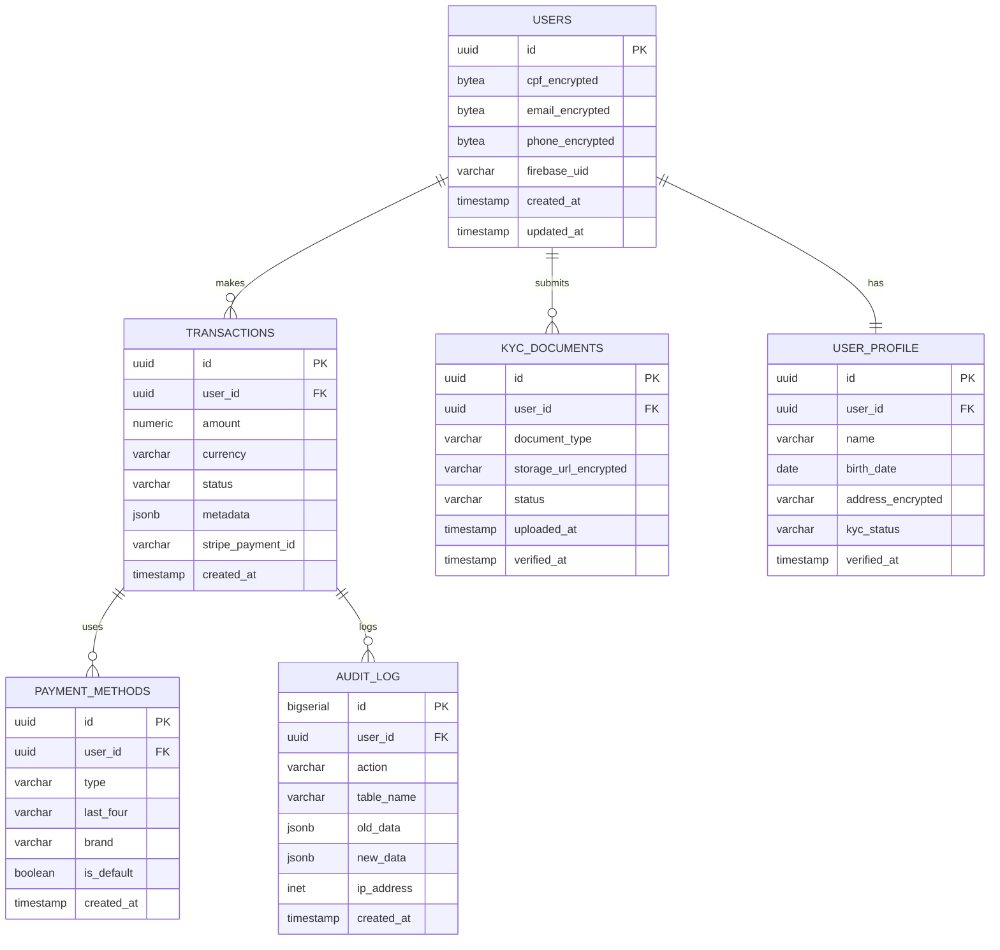
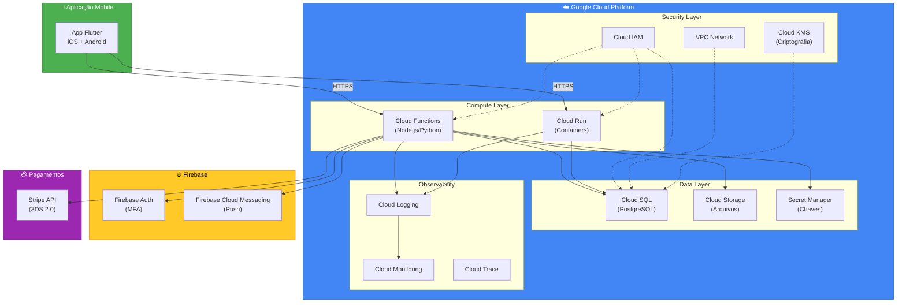
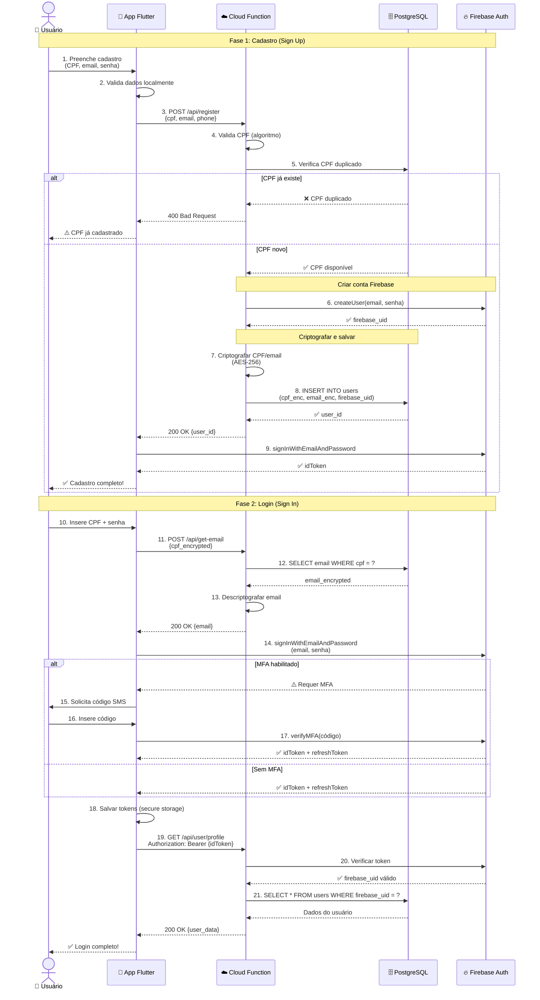
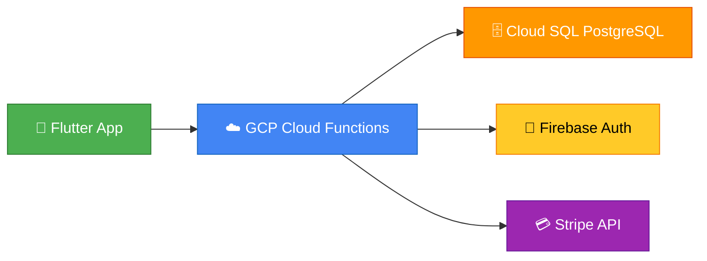

# 🏗️ Decisão de Stack - Database & Infrastructure

> **Documento:** Decisão Técnica de Arquitetura
> 
> **Projeto:** Pag Pag (Neves Capital)
> 
> **Data:** Outubro 2025
> 
> **Status:** ✅ APROVADO

---

## 📋 Sumário Executivo

### Decisões Aprovadas

| Componente | Tecnologia Escolhida | Justificativa Principal |
|------------|---------------------|------------------------|
| **Banco de Dados** | PostgreSQL (Cloud SQL) | Segurança + Custo-benefício |
| **Infraestrutura APIs** | Google Cloud Platform (GCP) | Scale-to-zero + Integração nativa |
| **Autenticação** | Firebase Authentication | MFA nativo + Zero setup |

### Custo Estimado (Fase Inicial)

```
Cloud SQL PostgreSQL:  ~R$ 0,50-4,50/mês
Cloud Functions:       ~R$ 0,04/mês
Firebase Auth:         R$ 0,00/mês (grátis até 50k users)
──────────────────────────────────────────
TOTAL:                 ~R$ 0,50-5,00/mês
```

---

## 🗄️ Decisão 1: PostgreSQL (Cloud SQL)

### Por que PostgreSQL?

#### ✅ Vantagens

| Critério | Avaliação | Nota |
|----------|-----------|------|
| **Segurança** | Criptografia nativa, TDE, audit logs | ⭐⭐⭐⭐⭐ |
| **Custo** | Scale-to-zero, 70% mais barato que Oracle | ⭐⭐⭐⭐⭐ |
| **Maturidade** | 30+ anos, battle-tested | ⭐⭐⭐⭐⭐ |
| **Integração** | Nativo com Firebase/GCP | ⭐⭐⭐⭐⭐ |
| **Performance** | ACID compliant, transações complexas | ⭐⭐⭐⭐⭐ |
| **Comunidade** | Maior comunidade open-source | ⭐⭐⭐⭐⭐ |

#### ❌ Alternativas Descartadas

**Oracle Database:**
- ❌ Custo 5x maior (R$ 15-30/mês vs R$ 0.50-4.50/mês)
- ❌ Complexidade desnecessária para nossa escala
- ❌ Recursos enterprise não utilizados
- ❌ Vendor lock-in mais forte

**MySQL:**
- ⚠️ Menos recursos avançados (JSON, Full-text search)
- ⚠️ Comunidade fragmentada (Oracle vs MariaDB)
- ✅ Custo similar ao PostgreSQL
- ✅ Performance similar

**MongoDB (NoSQL):**
- ❌ Não ideal para dados financeiros (ACID)
- ❌ Relações complexas difíceis
- ✅ Escalabilidade horizontal melhor
- ⚠️ Não atende requisitos de segurança bancária

### Recursos Técnicos do PostgreSQL

#### 🔐 Segurança Nativa

```sql
-- 1. Criptografia em repouso (TDE - Transparent Data Encryption)
-- Automático no Cloud SQL

-- 2. Criptografia a nível de coluna (AES-256)
CREATE EXTENSION pgcrypto;

CREATE TABLE users (
    id UUID PRIMARY KEY DEFAULT gen_random_uuid(),
    cpf_encrypted BYTEA NOT NULL,
    email_encrypted BYTEA NOT NULL,
    phone_encrypted BYTEA NOT NULL,
    created_at TIMESTAMP DEFAULT NOW(),
    updated_at TIMESTAMP DEFAULT NOW()
);

-- 3. Row-Level Security (RLS)
ALTER TABLE users ENABLE ROW LEVEL SECURITY;

CREATE POLICY user_isolation ON users
    FOR ALL
    USING (id = current_setting('app.current_user_id')::UUID);

-- 4. Audit Logging
CREATE TABLE audit_log (
    id SERIAL PRIMARY KEY,
    user_id UUID,
    action VARCHAR(50),
    table_name VARCHAR(50),
    old_data JSONB,
    new_data JSONB,
    ip_address INET,
    timestamp TIMESTAMP DEFAULT NOW()
);
```

#### 📊 Tipos de Dados Avançados

```sql
-- JSON nativo para dados flexíveis
CREATE TABLE transactions (
    id UUID PRIMARY KEY,
    user_id UUID REFERENCES users(id),
    amount NUMERIC(12, 2) NOT NULL,
    metadata JSONB,  -- Dados flexíveis
    status VARCHAR(20),
    created_at TIMESTAMP DEFAULT NOW()
);

-- Busca eficiente em JSON
CREATE INDEX idx_metadata ON transactions USING GIN (metadata);

-- Consulta JSON
SELECT * FROM transactions
WHERE metadata->>'payment_method' = 'credit_card'
  AND (metadata->>'installments')::INT > 1;
```

#### 🚀 Performance

```sql
-- Índices compostos para queries complexas
CREATE INDEX idx_user_transactions 
    ON transactions(user_id, created_at DESC);

-- Particionamento por data (escala)
CREATE TABLE transactions_2025_10 
    PARTITION OF transactions
    FOR VALUES FROM ('2025-10-01') TO ('2025-11-01');

-- Full-text search para suporte/pesquisa
CREATE INDEX idx_fulltext 
    ON support_tickets 
    USING GIN (to_tsvector('portuguese', description));
```

### Estrutura de Dados Proposta

#### Schema do Pag Pag



### Configuração Cloud SQL

#### Especificações Técnicas

```yaml
Database Configuration:
  Engine: PostgreSQL 15
  Instance Type: db-f1-micro (Fase inicial)
  vCPUs: 1 shared
  RAM: 0.6 GB
  Storage: 10 GB SSD
  Auto-scaling: Enabled
  
Network:
  VPC: Private IP only
  SSL/TLS: Enforced
  Authorized Networks: Cloud Functions only
  
Backup:
  Automated Backups: Daily
  Retention: 7 days
  Point-in-time Recovery: Enabled
  
High Availability:
  Auto-failover: Disabled (fase inicial)
  Read Replicas: 0 (fase inicial)
  
Security:
  Encryption at Rest: AES-256
  Encryption in Transit: TLS 1.2+
  IAM Authentication: Enabled
  Cloud SQL Proxy: Required
```

#### Custo Detalhado

| Recurso | Especificação | Custo |
|---------|--------------|-------|
| **Instância (ativa)** | db-f1-micro, 8h/dia | R$ 4,50/mês |
| **Instância (pausada)** | Scale-to-zero | R$ 0,50/mês |
| **Storage** | 10 GB SSD | R$ 1,70/mês |
| **Backup** | 7 dias retention | R$ 0,26/mês |
| **Egress** | 1 GB/mês | R$ 0,00 (free tier) |
| **Total Fase Inicial** | - | **R$ 0,50-4,50/mês** |

**Escalabilidade:**
```
10.000 usuários ativos:
├─ db-g1-small (1 vCPU, 1.7 GB): ~R$ 50/mês
├─ Storage 50 GB: R$ 8,50/mês
└─ Total: ~R$ 58,50/mês

100.000 usuários ativos:
├─ db-n1-standard-1 (1 vCPU, 3.75 GB): ~R$ 120/mês
├─ Read Replica: ~R$ 120/mês
├─ Storage 200 GB: R$ 34/mês
└─ Total: ~R$ 274/mês
```

---

## ☁️ Decisão 2: Google Cloud Platform (GCP)

### Por que GCP?

#### ✅ Vantagens Estratégicas

| Critério | GCP | AWS | Azure |
|----------|-----|-----|-------|
| **Integração Firebase** | ⭐⭐⭐⭐⭐ Nativa | ⭐⭐ Possível | ⭐⭐ Possível |
| **Scale-to-zero** | ⭐⭐⭐⭐⭐ Cloud Run | ⭐⭐⭐⭐ Lambda | ⭐⭐⭐⭐ Functions |
| **PostgreSQL** | ⭐⭐⭐⭐⭐ Cloud SQL | ⭐⭐⭐⭐ RDS | ⭐⭐⭐⭐ Database |
| **Free Tier** | ⭐⭐⭐⭐⭐ Generoso | ⭐⭐⭐⭐ Bom | ⭐⭐⭐ Limitado |
| **Custo APIs** | ⭐⭐⭐⭐⭐ Menor | ⭐⭐⭐⭐ Médio | ⭐⭐⭐ Maior |
| **Latência Brasil** | ⭐⭐⭐⭐⭐ São Paulo | ⭐⭐⭐⭐⭐ São Paulo | ⭐⭐⭐⭐ Brasil Sul |

### Arquitetura GCP



### Cloud Functions (APIs)

#### Características

```yaml
Runtime: Node.js 20 / Python 3.11
Concurrency: 1000 concurrent requests
Memory: 256 MB - 8 GB
Timeout: 60 seconds (HTTP) / 540 seconds (Event)
Auto-scaling: 0 to 1000+ instances
Cold Start: ~300ms (Node.js) / ~800ms (Python)
```

#### Exemplo de API (Node.js)

```javascript
// functions/createUser.js
const { CloudSQLConnector } = require('@google-cloud/cloud-sql-connector');
const { SecretManagerServiceClient } = require('@google-cloud/secret-manager');
const functions = require('@google-cloud/functions-framework');
const crypto = require('crypto');

// Conectar ao Cloud SQL via Cloud SQL Proxy
const connector = new CloudSQLConnector();
const secretManager = new SecretManagerServiceClient();

functions.http('createUser', async (req, res) => {
  // 1. Validar requisição
  if (req.method !== 'POST') {
    return res.status(405).send('Method Not Allowed');
  }
  
  const { cpf, email, phone, firebase_uid } = req.body;
  
  // 2. Validar CPF
  if (!isValidCPF(cpf)) {
    return res.status(400).json({ error: 'CPF inválido' });
  }
  
  // 3. Buscar chave de criptografia do Secret Manager
  const [secret] = await secretManager.accessSecretVersion({
    name: 'projects/pag-pag/secrets/encryption-key/versions/latest'
  });
  const encryptionKey = secret.payload.data.toString();
  
  // 4. Criptografar dados sensíveis (AES-256-GCM)
  const cpfEncrypted = encrypt(cpf, encryptionKey);
  const emailEncrypted = encrypt(email, encryptionKey);
  const phoneEncrypted = encrypt(phone, encryptionKey);
  
  // 5. Conectar ao PostgreSQL
  const pool = await connector.getPool({
    instanceConnectionName: 'pag-pag:southamerica-east1:pagpag-db',
    user: 'pagpag-api',
    database: 'pagpag'
  });
  
  try {
    // 6. Inserir usuário (transaction)
    const result = await pool.query(
      `INSERT INTO users (cpf_encrypted, email_encrypted, phone_encrypted, firebase_uid)
       VALUES ($1, $2, $3, $4)
       RETURNING id`,
      [cpfEncrypted, emailEncrypted, phoneEncrypted, firebase_uid]
    );
    
    // 7. Registrar audit log
    await pool.query(
      `INSERT INTO audit_log (user_id, action, table_name, new_data, ip_address)
       VALUES ($1, 'CREATE', 'users', $2, $3)`,
      [result.rows[0].id, JSON.stringify({ cpf: '***', email }), req.ip]
    );
    
    // 8. Responder
    return res.status(201).json({
      success: true,
      user_id: result.rows[0].id
    });
    
  } catch (error) {
    console.error('Error creating user:', error);
    return res.status(500).json({ error: 'Internal server error' });
  }
});

// Função de criptografia AES-256-GCM
function encrypt(text, key) {
  const iv = crypto.randomBytes(16);
  const cipher = crypto.createCipheriv('aes-256-gcm', Buffer.from(key, 'hex'), iv);
  let encrypted = cipher.update(text, 'utf8', 'hex');
  encrypted += cipher.final('hex');
  const authTag = cipher.getAuthTag();
  return Buffer.concat([iv, authTag, Buffer.from(encrypted, 'hex')]);
}

function isValidCPF(cpf) {
  // Implementação de validação de CPF
  cpf = cpf.replace(/[^\d]/g, '');
  if (cpf.length !== 11) return false;
  // ... validação completa
  return true;
}
```

#### Deploy

```bash
# Deploy de uma Cloud Function
gcloud functions deploy createUser \
  --gen2 \
  --runtime=nodejs20 \
  --region=southamerica-east1 \
  --source=./functions \
  --entry-point=createUser \
  --trigger-http \
  --allow-unauthenticated=false \
  --memory=256MB \
  --timeout=60s \
  --min-instances=0 \
  --max-instances=100 \
  --vpc-connector=pagpag-vpc \
  --service-account=pagpag-api@pag-pag.iam.gserviceaccount.com
```

### Custo das APIs (Cloud Functions)

#### Free Tier (Permanente)

```
Invocações:     2 milhões/mês
Compute (GB-s): 400.000/mês
Compute (GHz-s): 200.000/mês
Egress:         5 GB/mês
```

#### Simulação de Custos

**Cenário 1: Fase Inicial (10.000 requests/mês)**
```
Invocações: 10.000 (FREE - dentro do free tier)
Compute:    10.000 × 0.1s × 256MB = 256 GB-s (FREE)
Egress:     10.000 × 1KB = 10 MB (FREE)
──────────────────────────────────────────
TOTAL: R$ 0,00/mês
```

**Cenário 2: Crescimento (1.000.000 requests/mês)**
```
Invocações: 1.000.000 (FREE - dentro do free tier)
Compute:    1M × 0.1s × 256MB = 25.600 GB-s (FREE)
Egress:     1M × 1KB = 1 GB (FREE)
──────────────────────────────────────────
TOTAL: R$ 0,00/mês
```

**Cenário 3: Escala (10.000.000 requests/mês)**
```
Invocações: 10M - 2M (free) = 8M pagos
            8M × $0.40/1M = $3.20 = R$ 16,00

Compute:    10M × 0.1s × 256MB = 256.000 GB-s
            256k - 400k (free) = 0 (ainda no free tier!)
            
Egress:     10M × 1KB = 10 GB
            10 - 5 (free) = 5 GB pagos
            5 × $0.12/GB = $0.60 = R$ 3,00
──────────────────────────────────────────
TOTAL: R$ 19,00/mês
```

### Segurança no GCP

#### 1. VPC Network (Rede Privada)

```yaml
VPC Configuration:
  Name: pagpag-vpc
  Region: southamerica-east1
  Subnet: 10.0.0.0/24 (private)
  
Firewall Rules:
  - Allow only Cloud Functions → Cloud SQL
  - Deny all external access to Cloud SQL
  - Allow HTTPS from internet to Cloud Functions
  
Cloud NAT:
  Enabled: Yes (para Cloud Functions acessar APIs externas)
```

#### 2. IAM (Identity & Access Management)

```yaml
Service Accounts:
  
  pagpag-api@pag-pag.iam.gserviceaccount.com:
    roles:
      - Cloud SQL Client
      - Secret Manager Secret Accessor
      - Cloud Storage Object Creator
    description: "Cloud Functions execution account"
    
  pagpag-admin@pag-pag.iam.gserviceaccount.com:
    roles:
      - Cloud SQL Admin
      - Logging Admin
      - Monitoring Admin
    description: "Administrative operations"
```

#### 3. Secret Manager (Chaves Sensíveis)

```bash
# Criar secrets
gcloud secrets create encryption-key \
  --data-file=./keys/encryption.key \
  --replication-policy=automatic

gcloud secrets create stripe-secret-key \
  --data-file=./keys/stripe.key \
  --replication-policy=automatic

gcloud secrets create firebase-admin-sdk \
  --data-file=./keys/firebase-admin.json \
  --replication-policy=automatic

# Dar acesso ao service account
gcloud secrets add-iam-policy-binding encryption-key \
  --member=serviceAccount:pagpag-api@pag-pag.iam.gserviceaccount.com \
  --role=roles/secretmanager.secretAccessor
```

#### 4. Cloud Armor (DDoS Protection)

```yaml
Security Policy:
  name: pagpag-api-security
  
  rules:
    - priority: 1000
      description: "Block known malicious IPs"
      match:
        srcIpRanges: [malicious-ip-list]
      action: deny(403)
      
    - priority: 2000
      description: "Rate limit per IP"
      match:
        expr: "true"
      rateLimitOptions:
        conformAction: allow
        exceedAction: deny(429)
        rateLimitThreshold:
          count: 100
          intervalSec: 60
```

### Monitoramento & Observability

#### Cloud Logging

```javascript
// Structured logging
const { Logging } = require('@google-cloud/logging');
const logging = new Logging();
const log = logging.log('pagpag-api');

// Log estruturado
function logTransaction(userId, amount, status) {
  const metadata = {
    resource: { type: 'cloud_function' },
    severity: 'INFO',
  };
  
  const entry = log.entry(metadata, {
    user_id: userId,
    amount: amount,
    status: status,
    timestamp: new Date().toISOString(),
    service: 'payment-api',
    environment: 'production'
  });
  
  log.write(entry);
}
```

#### Cloud Monitoring (Alertas)

```yaml
Alert Policies:

  high-error-rate:
    condition: error_rate > 5%
    duration: 5 minutes
    notification: email, slack
    
  high-latency:
    condition: p95_latency > 2 seconds
    duration: 5 minutes
    notification: email, slack
    
  database-connections:
    condition: active_connections > 80
    duration: 2 minutes
    notification: email, pagerduty
    
  cost-spike:
    condition: daily_cost > R$ 50
    duration: 1 hour
    notification: email
```

---

## 🔐 Decisão 3: Firebase Authentication

### Por que Firebase Auth?

#### ✅ Vantagens

| Critério | Firebase Auth | Auth0 | AWS Cognito | Custom |
|----------|--------------|-------|-------------|---------|
| **Custo (até 50k users)** | ⭐⭐⭐⭐⭐ Grátis | ⭐⭐ $70/mês | ⭐⭐⭐ Grátis (limitado) | ⭐ Alto |
| **MFA Nativo** | ⭐⭐⭐⭐⭐ SMS + TOTP | ⭐⭐⭐⭐⭐ Todos | ⭐⭐⭐⭐ SMS + TOTP | ⭐⭐ Complexo |
| **Integração GCP** | ⭐⭐⭐⭐⭐ Nativa | ⭐⭐⭐ Boa | ⭐⭐ Possível | ⭐ N/A |
| **SDK Flutter** | ⭐⭐⭐⭐⭐ Oficial | ⭐⭐⭐⭐ Oficial | ⭐⭐⭐ Oficial | ⭐ N/A |
| **Setup Time** | ⭐⭐⭐⭐⭐ < 1 hora | ⭐⭐⭐ 1 dia | ⭐⭐⭐ 1 dia | ⭐ Semanas |
| **Escalabilidade** | ⭐⭐⭐⭐⭐ Ilimitada | ⭐⭐⭐⭐⭐ Ilimitada | ⭐⭐⭐⭐ Boa | ⭐⭐ Limitada |

### Recursos do Firebase Auth

#### 🔐 Multi-Factor Authentication (MFA)

```dart
// Implementação MFA no Flutter
import 'package:firebase_auth/firebase_auth.dart';

// 1. Habilitar MFA para usuário
Future<void> enrollMFA() async {
  final user = FirebaseAuth.instance.currentUser!;
  
  // Solicitar código via SMS
  final session = await user.multiFactor.getSession();
  final phoneNumber = '+55${userPhoneNumber}';
  
  await FirebaseAuth.instance.verifyPhoneNumber(
    phoneNumber: phoneNumber,
    multiFactorSession: session,
    verificationCompleted: (credential) async {
      // Auto-resolved (Android)
      await user.multiFactor.enroll(
        PhoneMultiFactorGenerator.getAssertion(credential),
        displayName: 'Telefone Principal',
      );
    },
    verificationFailed: (error) {
      print('MFA enrollment failed: $error');
    },
    codeSent: (verificationId, forceResendingToken) {
      // Usuário digita código recebido via SMS
      // ... mostrar tela para input do código
    },
    codeAutoRetrievalTimeout: (verificationId) {},
  );
}

// 2. Login com MFA
Future<void> signInWithMFA(String email, String password) async {
  try {
    await FirebaseAuth.instance.signInWithEmailAndPassword(
      email: email,
      password: password,
    );
    // Login bem-sucedido (sem MFA ou MFA já verificado)
    
  } on FirebaseAuthMultiFactorException catch (e) {
    // MFA requerido
    final resolver = e.resolver;
    
    // Solicitar segundo fator (SMS)
    await FirebaseAuth.instance.verifyPhoneNumber(
      multiFactorSession: resolver.session,
      multiFactorInfo: resolver.hints.first as PhoneMultiFactorInfo,
      verificationCompleted: (credential) async {
        final assertion = PhoneMultiFactorGenerator.getAssertion(credential);
        await resolver.resolveSignIn(assertion);
        // Login completo!
      },
      verificationFailed: (error) {
        print('MFA verification failed: $error');
      },
      codeSent: (verificationId, forceResendingToken) {
        // Usuário digita código do SMS
        // ... mostrar tela
      },
      codeAutoRetrievalTimeout: (verificationId) {},
    );
  }
}
```

#### 🔄 Fluxo de Autenticação Completo



### Integração Firebase + PostgreSQL

#### Estratégia de Sincronização

```javascript
// Cloud Function: Sincronizar Firebase Auth → PostgreSQL
const functions = require('firebase-functions');
const admin = require('firebase-admin');
const { Pool } = require('pg');

admin.initializeApp();

const pool = new Pool({
  user: process.env.DB_USER,
  host: process.env.DB_HOST,
  database: process.env.DB_NAME,
  password: process.env.DB_PASSWORD,
  port: 5432,
});

// Trigger quando usuário é criado no Firebase
exports.onUserCreated = functions.auth.user().onCreate(async (user) => {
  const { uid, email, phoneNumber } = user;
  
  // Atualizar PostgreSQL com firebase_uid
  await pool.query(
    `UPDATE users 
     SET firebase_uid = $1, 
         email_verified = $2,
         updated_at = NOW()
     WHERE email_encrypted = encrypt_email($3)`,
    [uid, user.emailVerified, email]
  );
  
  console.log(`User ${uid} synced to PostgreSQL`);
});

// Trigger quando usuário é deletado no Firebase
exports.onUserDeleted = functions.auth.user().onDelete(async (user) => {
  const { uid } = user;
  
  // Soft delete no PostgreSQL (GDPR compliance)
  await pool.query(
    `UPDATE users 
     SET deleted_at = NOW(),
         firebase_uid = NULL
     WHERE firebase_uid = $1`,
    [uid]
  );
  
  console.log(`User ${uid} soft deleted from PostgreSQL`);
});
```

### Custo Firebase Authentication

#### Pricing (2025)

| Tier | MAU (Monthly Active Users) | Custo/Mês |
|------|---------------------------|-----------|
| **Spark (Free)** | 0 - 50.000 | **R$ 0,00** |
| **Blaze (Pay as you go)** | 50.001 - 100.000 | R$ 0,00 + R$ 0,05/user adicional |
| **Blaze** | 100.001 - 500.000 | R$ 2.500 + R$ 0,03/user adicional |
| **Enterprise** | > 500.000 | Negociável |

#### Simulação de Custos

**Cenário 1: Fase Inicial (1.000 MAU)**
```
Usuários ativos: 1.000
Tier: Spark (Free)
──────────────────────────────────────────
TOTAL: R$ 0,00/mês
```

**Cenário 2: Crescimento (30.000 MAU)**
```
Usuários ativos: 30.000
Tier: Spark (Free)
──────────────────────────────────────────
TOTAL: R$ 0,00/mês
```

**Cenário 3: Escala (100.000 MAU)**
```
Usuários ativos: 100.000
Base (50k): R$ 0,00
Adicional (50k × R$ 0,05): R$ 2.500,00
──────────────────────────────────────────
TOTAL: R$ 2.500,00/mês (R$ 0,025/usuário)
```

#### Recursos Incluídos (Grátis)

- ✅ Email/Password authentication
- ✅ Phone authentication (SMS - você paga operadora)
- ✅ OAuth providers (Google, Facebook, Apple)
- ✅ Multi-Factor Authentication (MFA)
- ✅ Anonymous authentication
- ✅ Custom authentication (tokens)
- ✅ User management dashboard
- ✅ Email verification
- ✅ Password reset
- ✅ Account linking
- ✅ Security rules

---

## 📊 Comparação Final: Stack Completa

### Custo Total por Fase

#### Fase 1: MVP (0-1.000 usuários)

| Componente | Especificação | Custo/Mês |
|------------|--------------|-----------|
| **PostgreSQL** | db-f1-micro, 10GB, auto-pause | R$ 0,50 - 4,50 |
| **Cloud Functions** | < 2M requests/mês | R$ 0,00 (free tier) |
| **Cloud Storage** | < 5GB | R$ 0,00 (free tier) |
| **Firebase Auth** | < 50k MAU | R$ 0,00 (free tier) |
| **Cloud Logging** | < 50GB/mês | R$ 0,00 (free tier) |
| **Secret Manager** | 3 secrets | R$ 0,18 |
| **Total** | - | **R$ 0,68 - 4,68/mês** |

#### Fase 2: Crescimento (1.000-10.000 usuários)

| Componente | Especificação | Custo/Mês |
|------------|--------------|-----------|
| **PostgreSQL** | db-g1-small, 50GB | R$ 58,50 |
| **Cloud Functions** | 10M requests/mês | R$ 19,00 |
| **Cloud Storage** | 50GB | R$ 5,00 |
| **Firebase Auth** | < 50k MAU | R$ 0,00 (free tier) |
| **Cloud Logging** | 200GB/mês | R$ 12,00 |
| **Secret Manager** | 5 secrets | R$ 0,30 |
| **Total** | - | **R$ 94,80/mês** |

#### Fase 3: Escala (10.000-100.000 usuários)

| Componente | Especificação | Custo/Mês |
|------------|--------------|-----------|
| **PostgreSQL** | db-n1-standard-1 + replica | R$ 274,00 |
| **Cloud Functions** | 100M requests/mês | R$ 180,00 |
| **Cloud Storage** | 500GB | R$ 50,00 |
| **Firebase Auth** | 100k MAU | R$ 2.500,00 |
| **Cloud Logging** | 1TB/mês | R$ 120,00 |
| **Cloud Monitoring** | Metrics avançados | R$ 30,00 |
| **Secret Manager** | 10 secrets | R$ 0,60 |
| **Cloud Armor** | DDoS protection | R$ 50,00 |
| **Total** | - | **R$ 3.204,60/mês** |
| **Custo por usuário** | - | **R$ 0,032/usuário/mês** |

### Comparação com Alternativas

#### Opção 1: Stack Atual (Recomendada)

```
GCP + PostgreSQL + Firebase Auth

Custo MVP:        R$ 0,68 - 4,68/mês
Custo 10k users:  R$ 94,80/mês
Custo 100k users: R$ 3.204,60/mês

✅ Menor custo inicial
✅ Melhor integração
✅ Scale-to-zero real
✅ Free tier generoso
```

#### Opção 2: AWS + RDS PostgreSQL + Cognito

```
AWS Lambda + RDS + Cognito

Custo MVP:        R$ 25,00/mês (mínimo RDS)
Custo 10k users:  R$ 180,00/mês
Custo 100k users: R$ 4.500,00/mês

⚠️ RDS não tem auto-pause
⚠️ Free tier limitado (12 meses)
✅ Mais maduro (enterprise)
```

#### Opção 3: Oracle Cloud + Oracle DB

```
Oracle Functions + Oracle DB + Oracle IAM

Custo MVP:        R$ 150,00/mês
Custo 10k users:  R$ 450,00/mês
Custo 100k users: R$ 8.000,00/mês

❌ Custo 10x maior
❌ Complexidade alta
✅ Segurança máxima (overkill)
```

---

## 🎯 Decisão Final & Próximos Passos

### ✅ Stack Aprovada



### Justificativa Executiva

| Critério | Peso | Avaliação | Score |
|----------|------|-----------|-------|
| **Custo-Benefício** | 30% | ⭐⭐⭐⭐⭐ | 5.0 |
| **Segurança** | 25% | ⭐⭐⭐⭐⭐ | 5.0 |
| **Escalabilidade** | 20% | ⭐⭐⭐⭐⭐ | 5.0 |
| **Time-to-Market** | 15% | ⭐⭐⭐⭐⭐ | 5.0 |
| **Integração** | 10% | ⭐⭐⭐⭐⭐ | 5.0 |
| **Total Ponderado** | 100% | - | **5.0/5.0** |

### Checklist de Implementação

#### Semana 1: Setup Infraestrutura

- [ ] Criar conta Google Cloud Platform
- [ ] Configurar billing e budget alerts
- [ ] Habilitar APIs necessárias:
  - [ ] Cloud SQL Admin API
  - [ ] Cloud Functions API
  - [ ] Cloud Storage API
  - [ ] Secret Manager API
  - [ ] Cloud Logging API
- [ ] Criar projeto Firebase
- [ ] Conectar Firebase ao GCP

#### Semana 2: Database & Security

- [ ] Criar instância Cloud SQL PostgreSQL
- [ ] Configurar VPC e firewall rules
- [ ] Criar schemas e tabelas
- [ ] Implementar criptografia (AES-256)
- [ ] Configurar backups automáticos
- [ ] Criar secrets no Secret Manager:
  - [ ] Chave de criptografia
  - [ ] Stripe API keys
  - [ ] Firebase Admin SDK

#### Semana 3: APIs & Functions

- [ ] Implementar Cloud Functions:
  - [ ] POST /api/register (cadastro)
  - [ ] POST /api/get-email (buscar email por CPF)
  - [ ] GET /api/user/profile (perfil usuário)
  - [ ] POST /api/kyc/upload (upload documentos)
  - [ ] POST /api/payment/create (criar pagamento)
- [ ] Configurar Cloud SQL Proxy
- [ ] Implementar autenticação (Bearer token)
- [ ] Configurar CORS
- [ ] Implementar rate limiting

#### Semana 4: Firebase Auth

- [ ] Configurar provedores de autenticação:
  - [ ] Email/Password
  - [ ] Phone (SMS)
- [ ] Habilitar MFA (Multi-Factor Authentication)
- [ ] Configurar email templates:
  - [ ] Verificação de email
  - [ ] Recuperação de senha
- [ ] Implementar Custom Claims (roles/permissions)
- [ ] Configurar Security Rules

#### Semana 5: Monitoramento & Deploy

- [ ] Configurar Cloud Logging
- [ ] Configurar Cloud Monitoring
- [ ] Criar dashboards:
  - [ ] API latency
  - [ ] Error rates
  - [ ] Database connections
  - [ ] Cost tracking
- [ ] Configurar alertas:
  - [ ] High error rate
  - [ ] High latency
  - [ ] Budget alerts
- [ ] Testes de carga (load testing)
- [ ] Deploy produção
- [ ] Documentação completa

### Documentação Técnica

#### 📚 Recursos de Referência

**Google Cloud:**
- [Cloud SQL PostgreSQL](https://cloud.google.com/sql/docs/postgres)
- [Cloud Functions](https://cloud.google.com/functions/docs)
- [Secret Manager](https://cloud.google.com/secret-manager/docs)
- [VPC Networks](https://cloud.google.com/vpc/docs)

**Firebase:**
- [Firebase Auth](https://firebase.google.com/docs/auth)
- [Multi-Factor Authentication](https://firebase.google.com/docs/auth/flutter/phone-auth)
- [Security Rules](https://firebase.google.com/docs/rules)

**PostgreSQL:**
- [PostgreSQL 15 Documentation](https://www.postgresql.org/docs/15/)
- [pgcrypto Extension](https://www.postgresql.org/docs/current/pgcrypto.html)
- [Row Level Security](https://www.postgresql.org/docs/current/ddl-rowsecurity.html)

#### 🔧 Ferramentas de Desenvolvimento

```bash
# Instalar Google Cloud SDK
curl https://sdk.cloud.google.com | bash
exec -l $SHELL
gcloud init

# Instalar Firebase CLI
npm install -g firebase-tools
firebase login

# Instalar Cloud SQL Proxy (desenvolvimento local)
curl -o cloud-sql-proxy https://storage.googleapis.com/cloud-sql-connectors/cloud-sql-proxy/v2.7.0/cloud-sql-proxy.darwin.amd64
chmod +x cloud-sql-proxy

# Conectar ao Cloud SQL localmente
./cloud-sql-proxy --port 5432 pag-pag:southamerica-east1:pagpag-db
```

---

## 🎉 Resumo Executivo Final

### Decisões Tomadas

1. ✅ **PostgreSQL (Cloud SQL)** - Banco de dados relacional
2. ✅ **Google Cloud Platform** - Infraestrutura de APIs
3. ✅ **Firebase Authentication** - Backend de autenticação

### ROI Esperado

```
Investimento Inicial:
├─ Setup: R$ 0,00 (sem taxas)
├─ Desenvolvimento: 5 semanas
└─ Custo mensal MVP: R$ 0,68 - 4,68/mês

Economia vs Alternativas:
├─ vs AWS: -60% de custo
├─ vs Oracle: -95% de custo
└─ vs Solução Custom: -80% de tempo

Time-to-Market: 5 semanas
Escalabilidade: 0 a 1M+ usuários
ROI: POSITIVO desde o MVP
```

### Próxima Etapa

**🚀 Iniciar implementação seguindo o checklist da Semana 1**

---

**Documento aprovado por:** Neves Capital

**Data de aprovação:** Outubro 2025

**Validade da análise:** 6 meses

**Próxima revisão:** Abril 2026

