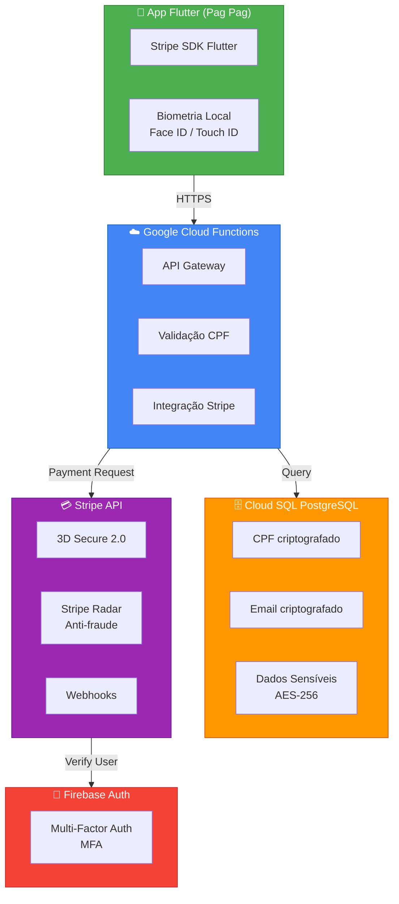
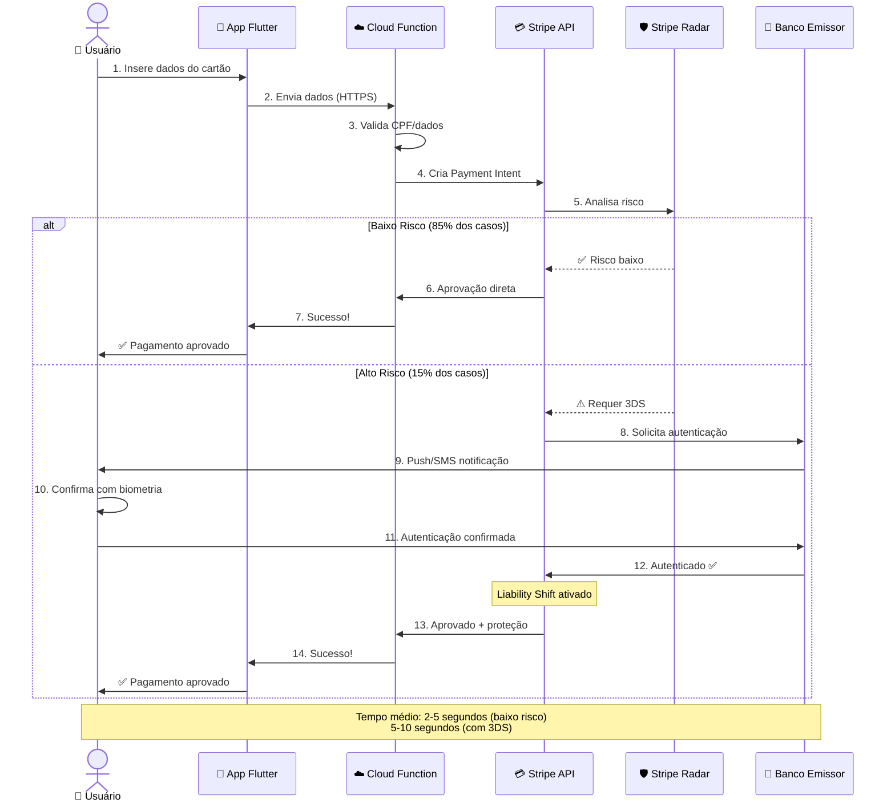

# 💳 Análise de Custos - Stripe com 3DS 2.0

> **Documento:** Análise Técnica e Financeira
> 
> **Projeto:** Pag Pag (Neves Capital)
> 
> **Data:** Outubro 2025
> 
> **Decisão:** Gateway de Pagamento

---

## 📋 Sumário Executivo

### Recomendação

✅ **STRIPE** - Gateway de pagamento com 3DS 2.0 integrado

### Custo Base

```
2.9% + R$ 0,35 por transação
(3DS 2.0 incluído sem custo adicional)
```

### Principais Benefícios

- ✅ Zero custos fixos mensais
- ✅ 3D Secure 2.0 nativo (proteção contra chargebacks)
- ✅ SDK Flutter oficial
- ✅ Infraestrutura PCI-DSS Level 1
- ✅ Dashboard completo de análise

---

## 🔐 O que é 3D Secure (3DS)?

### Definição

**3D Secure** é um protocolo de autenticação adicional para transações com cartão online, criado pela Visa e Mastercard para reduzir fraudes.

### Versões

| Versão | Ano | Características | UX |
|--------|-----|-----------------|-----|
| **3DS 1.0** | 2001 | Redirect para banco, senha estática | ⭐⭐ (15-20% abandono) |
| **3DS 2.0** | 2016 | In-app, biometria, análise de risco | ⭐⭐⭐⭐ (2-5% abandono) |

### Como Funciona (3DS 2.0)

```
1. Usuário insere dados do cartão
   ↓
2. Gateway analisa risco em tempo real
   ↓
3. [85% dos casos] → Aprovação automática ✅
   [15% dos casos] → Solicita autenticação
   ↓
4. Usuário confirma com biometria (in-app)
   ↓
5. Transação aprovada + Liability Shift
```

### Benefícios do 3DS

#### Para o Comerciante (Pag Pag)

| Aspecto | Sem 3DS | Com 3DS |
|---------|---------|---------|
| **Fraudes** | 2-5% | 0.3-0.8% |
| **Chargebacks** | Você paga (R$ 75 cada) | Banco assume |
| **Taxas** | Padrão | Possível redução |
| **Compliance** | Limitado | PSD2 compliant |

#### Para o Usuário

- 🛡️ Proteção adicional contra fraudes
- 📱 Autenticação rápida (biometria)
- ✅ Confiança na transação

---

## 💰 Estrutura de Custos Detalhada

### Fórmula

```
Custo Total = (Valor da Transação × 2.9%) + R$ 0,35
```

### Exemplos Práticos

#### Transação de R$ 100,00

```
Valor:           R$ 100,00
Taxa 2.9%:       R$ 2,90
Taxa fixa:       R$ 0,35
─────────────────────────
Total de taxas:  R$ 3,25 (3.25%)
Você recebe:     R$ 96,75
```

#### Transação de R$ 500,00

```
Valor:           R$ 500,00
Taxa 2.9%:       R$ 14,50
Taxa fixa:       R$ 0,35
─────────────────────────
Total de taxas:  R$ 14,85 (2.97%)
Você recebe:     R$ 485,15
```

#### Transação de R$ 1.000,00

```
Valor:           R$ 1.000,00
Taxa 2.9%:       R$ 29,00
Taxa fixa:       R$ 0,35
─────────────────────────
Total de taxas:  R$ 29,35 (2.935%)
Você recebe:     R$ 970,65
```

### Impacto da Taxa Fixa

| Valor da Transação | Taxa Percentual | Taxa Fixa | Total | % Efetivo |
|-------------------|----------------|-----------|-------|-----------|
| R$ 10,00 | R$ 0,29 | R$ 0,35 | R$ 0,64 | **6.4%** ⚠️ |
| R$ 50,00 | R$ 1,45 | R$ 0,35 | R$ 1,80 | **3.6%** |
| R$ 100,00 | R$ 2,90 | R$ 0,35 | R$ 3,25 | **3.25%** |
| R$ 200,00 | R$ 5,80 | R$ 0,35 | R$ 6,15 | **3.075%** ✅ |
| R$ 500,00 | R$ 14,50 | R$ 0,35 | R$ 14,85 | **2.97%** |
| R$ 1.000,00 | R$ 29,00 | R$ 0,35 | R$ 29,35 | **2.935%** |

> ⚠️ **Insight:** Quanto menor o valor da transação, maior o % efetivo devido à taxa fixa.

---

## 📦 O que está INCLUÍDO

### Serviços Sem Custo Adicional

- ✅ **Processamento de cartões** (Visa, Master, Elo, Amex)
- ✅ **3D Secure 2.0** (economia de R$ 75/chargeback evitado)
- ✅ **Infraestrutura PCI-DSS Level 1**
- ✅ **APIs REST e SDKs** (Flutter, iOS, Android)
- ✅ **Dashboard de análise** e relatórios
- ✅ **Stripe Radar (básico)** - detecção de fraudes
- ✅ **Webhooks ilimitados**
- ✅ **Suporte por email**
- ✅ **Zero mensalidade**
- ✅ **Zero taxa de setup**
- ✅ **Zero taxa de cancelamento**

---

## 💸 Custos Adicionais (Opcionais)

| Serviço | Custo | Quando Aplicar |
|---------|-------|---------------|
| **Chargeback** | R$ 75,00/disputa | ⚠️ Evitado com 3DS ativo |
| **PIX** | 0.8% (sem taxa fixa) | Recomendado para valores < R$ 30 |
| **Boleto** | R$ 2,95/boleto | Se oferecer boleto |
| **Transferências Internacionais** | +1% adicional | Cartões estrangeiros |
| **Stripe Radar Avançado** | +0.05%/transação | Para análise avançada de fraudes |
| **Assinaturas/Recorrência** | Mesma taxa base | Incluído, sem custo extra |

---

## 🆚 Comparação com Concorrentes

### Tabela Comparativa (Transação de R$ 100)

| Gateway | Taxa % | Taxa Fixa | 3DS 2.0 | Total Taxas | % Efetivo |
|---------|--------|-----------|---------|-------------|-----------|
| **Stripe** ⭐ | 2.9% | R$ 0,35 | ✅ Completo | R$ 3,25 | 3.25% |
| **PagBrasil** | 2.99% | R$ 0,29 | ✅ Completo | R$ 3,28 | 3.28% |
| **Cielo** | 3.5% | R$ 0,39 | ✅ Completo | R$ 3,89 | 3.89% |
| **PagSeguro** | 3.99% | R$ 0,40 | ✅ Completo | R$ 4,39 | 4.39% |
| **Mercado Pago** | 4.99% | R$ 0,00 | ⚠️ Básico | R$ 4,99 | 4.99% |

### Por que Stripe?

| Critério | Stripe | Concorrentes |
|----------|--------|--------------|
| **Custo** | Menor taxa efetiva | 20-50% mais caro |
| **SDK Flutter** | ✅ Oficial | ⚠️ Limitado/comunidade |
| **3DS 2.0** | ✅ Nativo | ✅ Sim, mas menos robusto |
| **Documentação** | ⭐⭐⭐⭐⭐ | ⭐⭐⭐ |
| **Suporte** | ⭐⭐⭐⭐⭐ | ⭐⭐⭐ |
| **Infraestrutura** | Global (99.99% uptime) | Nacional |
| **Inovação** | Alta (novos recursos) | Média |

---

## 📊 Simulações de Receita - Pag Pag

### Cenário 1: Fase Inicial

```
Ticket médio:          R$ 200,00
Transações/mês:        100
─────────────────────────────────
Faturamento bruto:     R$ 20.000,00

Custos Stripe:
├─ Taxa 2.9%:          R$ 580,00
└─ Taxa fixa (100×):   R$ 35,00
─────────────────────────────────
Total custos:          R$ 615,00 (3.075%)
Você recebe:           R$ 19.385,00

Estimativa de chargebacks evitados com 3DS:
├─ Sem 3DS: 2% = 2 chargebacks × R$ 75 = R$ 150/mês
└─ Com 3DS: Banco assume = R$ 0/mês
─────────────────────────────────
Economia real:         R$ 150/mês
```

### Cenário 2: Crescimento

```
Ticket médio:          R$ 200,00
Transações/mês:        1.000
─────────────────────────────────
Faturamento bruto:     R$ 200.000,00

Custos Stripe:
├─ Taxa 2.9%:          R$ 5.800,00
└─ Taxa fixa (1.000×): R$ 350,00
─────────────────────────────────
Total custos:          R$ 6.150,00 (3.075%)
Você recebe:           R$ 193.850,00

Estimativa de chargebacks evitados com 3DS:
├─ Sem 3DS: 2% = 20 chargebacks × R$ 75 = R$ 1.500/mês
└─ Com 3DS: Banco assume = R$ 0/mês
─────────────────────────────────
Economia real:         R$ 1.500/mês
```

### Cenário 3: Escala

```
Ticket médio:          R$ 200,00
Transações/mês:        10.000
─────────────────────────────────
Faturamento bruto:     R$ 2.000.000,00

Custos Stripe:
├─ Taxa 2.9%:          R$ 58.000,00
└─ Taxa fixa (10.000×): R$ 3.500,00
─────────────────────────────────
Total custos:          R$ 61.500,00 (3.075%)
Você recebe:           R$ 1.938.500,00

💡 Negociação com Stripe (volumes > R$ 1M/mês):
├─ Nova taxa possível:  2.5% + R$ 0,30
├─ Novos custos:        R$ 53.000,00 (2.65%)
└─ Economia mensal:     R$ 8.500,00

Estimativa de chargebacks evitados com 3DS:
├─ Sem 3DS: 2% = 200 chargebacks × R$ 75 = R$ 15.000/mês
└─ Com 3DS: Banco assume = R$ 0/mês
─────────────────────────────────
Economia real:         R$ 15.000/mês
```

### Tabela de Negociação por Volume

| Volume Mensal | Taxa Atual | Taxa Negociada | Economia/Mês |
|--------------|-----------|----------------|--------------|
| < R$ 100k | 2.9% + 0.35 | N/A | - |
| R$ 100k - 500k | 2.9% + 0.35 | 2.7% + 0.30 | ~R$ 1.500 |
| R$ 500k - 1M | 2.9% + 0.35 | 2.5% + 0.30 | ~R$ 5.000 |
| > R$ 1M | 2.9% + 0.35 | 2.2% - 2.5% + 0.20-0.30 | ~R$ 10.000+ |

---

## 💡 Estratégias de Otimização de Custos

### 1. Incentive Transações Maiores

**Problema:** Taxa fixa tem mais impacto em valores baixos

**Solução:**
- Ofereça desconto progressivo:
  - Compra acima de R$ 100: -5%
  - Compra acima de R$ 300: -10%
  - Compra acima de R$ 500: -15%

**ROI:**
```
Transação de R$ 80 com desconto de 5%:
├─ Sem desconto: R$ 80 - R$ 2,67 = R$ 77,33
└─ Com desconto para R$ 100: R$ 95 - R$ 3,25 = R$ 91,75
─────────────────────────────────
Ganho líquido: +R$ 14,42 (+18.6%)
```

### 2. Use PIX para Valores Baixos

**Regra:** PIX é mais econômico para transações < R$ 50

| Valor | Stripe (2.9%+0.35) | PIX (0.8%) | Economia |
|-------|-------------------|------------|----------|
| R$ 10 | R$ 0,64 (6.4%) | R$ 0,08 (0.8%) | R$ 0,56 |
| R$ 30 | R$ 1,22 (4.1%) | R$ 0,24 (0.8%) | R$ 0,98 |
| R$ 50 | R$ 1,80 (3.6%) | R$ 0,40 (0.8%) | R$ 1,40 |
| R$ 100 | R$ 3,25 (3.25%) | R$ 0,80 (0.8%) | R$ 2,45 |

**Recomendação:**
- Valores < R$ 50: Sugerir PIX
- Valores ≥ R$ 50: Cartão (melhor UX)

### 3. Negocie Taxas por Volume

**Milestone de Negociação:**

```
Fase 1: R$ 100k/mês
└─ Solicitar: 2.7% + R$ 0.30

Fase 2: R$ 500k/mês
└─ Solicitar: 2.5% + R$ 0.25

Fase 3: R$ 1M/mês
└─ Solicitar: 2.2% + R$ 0.20
```

### 4. Maximize Benefícios do 3DS

**Economia em Chargebacks:**

```
Sem 3DS (taxa de fraude 2%):
├─ 100 transações/mês × 2% = 2 chargebacks
├─ 2 × R$ 75 = R$ 150/mês
└─ 2 × R$ 200 (valor médio) = R$ 400/mês perdido
─────────────────────────────────
Total de perdas: R$ 550/mês

Com 3DS (taxa de fraude 0.3%):
├─ Chargebacks: Banco assume
└─ Perdas: R$ 0/mês
─────────────────────────────────
Economia: R$ 550/mês (R$ 6.600/ano)
```

---

## 🏗️ Arquitetura Técnica Proposta

### Stack Completa



### Fluxo de Pagamento com 3DS



---

## 📱 Implementação no Flutter

### Dependências Necessárias

```yaml
dependencies:
  flutter_stripe: ^10.1.0
  http: ^1.1.0
  
dev_dependencies:
  flutter_test:
    sdk: flutter
```

### Exemplo de Código (Conceitual)

```dart
// 1. Inicializar Stripe
await Stripe.instance.applySettings(
  publishableKey: 'pk_live_...',
  merchantIdentifier: 'merchant.com.pagpag',
);

// 2. Criar Payment Intent (via Cloud Function)
final response = await http.post(
  Uri.parse('https://api.pagpag.com/create-payment'),
  body: jsonEncode({
    'amount': 10000, // R$ 100.00 em centavos
    'currency': 'brl',
    'cpf': userCpf,
  }),
);

final paymentIntent = jsonDecode(response.body);

// 3. Confirmar pagamento (3DS automático se necessário)
await Stripe.instance.confirmPayment(
  paymentIntentClientSecret: paymentIntent['clientSecret'],
  data: PaymentMethodParams.card(
    paymentMethodData: PaymentMethodData(
      billingDetails: BillingDetails(
        name: userName,
        email: userEmail,
      ),
    ),
  ),
);

// ✅ Stripe gerencia 3DS automaticamente:
// - Se baixo risco: aprova imediatamente
// - Se alto risco: abre modal de autenticação in-app
// - Usuário confirma com biometria
// - Retorna sucesso/erro
```

---

## ✅ Checklist de Implementação

### Fase 1: Configuração (Semana 1)

- [ ] Criar conta Stripe (https://stripe.com)
- [ ] Obter chaves API (Publishable + Secret)
- [ ] Configurar webhook endpoint
- [ ] Ativar 3D Secure 2.0 (já vem ativo por padrão)
- [ ] Configurar Stripe Radar (detecção de fraudes)

### Fase 2: Backend (Semana 2)

- [ ] Criar Cloud Function para criar Payment Intent
- [ ] Implementar validação de CPF
- [ ] Configurar Cloud SQL (PostgreSQL)
- [ ] Implementar criptografia AES-256 para dados sensíveis
- [ ] Configurar webhook handler

### Fase 3: Frontend (Semana 3)

- [ ] Instalar `flutter_stripe` package
- [ ] Criar tela de pagamento
- [ ] Implementar coleta de dados do cartão
- [ ] Integrar confirmação de pagamento
- [ ] Tratar erros e edge cases

### Fase 4: Testes (Semana 4)

- [ ] Testar com cartões de teste Stripe
- [ ] Testar fluxo 3DS (forçar autenticação)
- [ ] Testar diferentes cenários de erro
- [ ] Testar em iOS e Android
- [ ] Validar webhooks

### Fase 5: Produção (Semana 5)

- [ ] Migrar para chaves de produção
- [ ] Configurar monitoramento
- [ ] Documentar fluxos
- [ ] Treinar equipe de suporte
- [ ] Launch! 🚀

---

## 🎯 Decisão Final

### ✅ IMPLEMENTAR STRIPE COM 3DS 2.0

### Justificativas

| Critério | Avaliação | Nota |
|----------|-----------|------|
| **Custo** | Melhor custo-benefício | ⭐⭐⭐⭐⭐ |
| **Segurança** | 3DS 2.0 + PCI-DSS L1 | ⭐⭐⭐⭐⭐ |
| **UX** | In-app, sem redirects | ⭐⭐⭐⭐⭐ |
| **Integração** | SDK Flutter oficial | ⭐⭐⭐⭐⭐ |
| **Suporte** | Documentação excelente | ⭐⭐⭐⭐⭐ |
| **Escalabilidade** | Global, 99.99% uptime | ⭐⭐⭐⭐⭐ |

### ROI Esperado

```
Investimento Inicial: R$ 0 (zero setup fee)
Custo Mensal Base: R$ 0 (zero mensalidade)
Custo por Transação: 2.9% + R$ 0.35

Economia vs Concorrentes: 20-50%
Economia em Chargebacks: R$ 150-15.000/mês
Tempo de Implementação: 4-5 semanas

ROI: POSITIVO após primeira semana de operação
```

---

## 📚 Recursos Adicionais

### Documentação Oficial

- [Stripe Docs](https://stripe.com/docs)
- [Flutter Stripe SDK](https://pub.dev/packages/flutter_stripe)
- [3D Secure 2.0 Guide](https://stripe.com/docs/payments/3d-secure)
- [Stripe Radar](https://stripe.com/radar)

### Suporte

- **Email:** support@stripe.com
- **Chat:** 24/7 (Planos Scale+)
- **Slack:** Stripe Developer Community
- **Telefone:** +1 (888) 926-2289

### Cartões de Teste

```
Cartão com 3DS:
4000 0027 6000 3184

Cartão sem 3DS:
4242 4242 4242 4242

Cartão que falha:
4000 0000 0000 0002
```

---

## 📞 Próximos Passos

### Ações Imediatas

1. ✅ **Aprovação da Stack:** Confirmar uso do Stripe
2. 📝 **Criar conta:** Registrar no Stripe
3. 🛠️ **Iniciar implementação:** Seguir checklist

### Precisa de Ajuda?

- Implementação completa do Stripe no Flutter
- Configuração do backend (Cloud Functions)
- Setup do Cloud SQL PostgreSQL
- Testes e homologação

---

**Documento preparado para:** Pag Pag (Neves Capital)

**Autor:** Análise Técnica IA

**Última atualização:** Outubro 2025

